# LangGraph MultiAgent 架构现状与目标（AS-IS / TO-BE）

## 1. 文档目的与权威边界

本文是 LangGraph MultiAgent 实施前的 canonical 技术架构基线。它定义当前真实架构、目标双域架构、AI Runtime planes、MultiAgent 协议、LLM trace persistence、数据边界、前端运行时边界、迁移路线和后端 function package 的架构约束。

权威边界：

| 事项 | 结论 |
|---|---|
| 本文职责 | 架构现状 / 目标、核心术语、协议、边界、图、迁移路线和 invariants |
| 本目录入口 | `docs/03-delivery/refactor-multiagent-langgraph-implementation/README.md` |
| 后端 PR 顺序 | `02_BACKEND_REFACTOR_MASTER_PLAN.md` |
| 后端方法 / 字段 / graph node 细节 | `03_BACKEND_FUNCTION_PACKAGES/*.md`，但只能引用本文架构定义 |
| 前端状态机和组件计划 | `04_FRONTEND_LANGGRAPH_UI_PLAN.md` |
| 当前有效文档 | `docs/02-design/*`、`docs/03-delivery/BACKLOG.md`、`docs/03-delivery/DELIVERY_PLAN.md`、ADR-0005 |
| 历史 planning package | superseded; see Git history；不作为本 implementation set 的入口 |

本文不授权代码实现，不修改 `apps/**`、`tests/**`、依赖、migration、CI、ADR、`BACKLOG.md` 或 `DOCS_INDEX.md`。本文也不把 ADR-0005 从 `Proposed` 升级为完整 Accepted。PR2 仍保持 `CONDITIONAL GO`，只允许在 exact scope lock 内实施 inert AI Runtime data model / repository / backend tests。

## 2. 当前真实架构（AS-IS）

当前后端是 FastAPI 单体服务，已有 `api` / `application` / `domain` / `infrastructure` 分层和基础 import-boundary tests。当前没有 LangGraph / LangChain 依赖，没有 `application/ai_runtime/**` 或 `infrastructure/ai_runtime/langgraph/**` 目录，没有 `AgentGraphRunner`、`AiOrchestrationFacade`、`AgentRun`、`AgentNodeRun`、`AgentInterrupt`、`AgentCheckpointRef` 或 `llm_calls` 运行时数据层。

当前 AI 能力以直接 application use case + LLM transport / deterministic fallback 为主。Polish 是当前唯一具备 first real business graph migration 成熟度的路径，因为 Polish mode 已有较完整的 question / feedback / progress tree 代码和回归覆盖。Job Match / ResumeAnalysis、Pressure、Report、Review、Asset、Weakness、Training 的 Agent capability 尚不足以直接进入完整业务 graph migration；它们可以先保留 backend stubs、descriptors、DTOs 或 graph placeholders，待对应 dedicated migration PR 再迁移。

### 当前系统架构图（AS-IS system architecture）

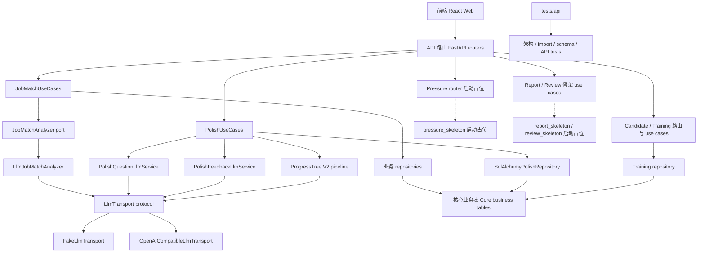

## 3. 当前模块成熟度矩阵（AS-IS）

| 范围 | 当前文件 / 符号 | 成熟度 | 现有 LLM 调用 | 现有持久化 | 测试 | 缺口 |
|---|---|---|---|---|---|---|
| Architecture boundary | `tests/api/test_architecture_boundaries.py` | 已实现 guard | N/A | N/A | domain 禁止 framework / infrastructure；API 禁止 DB model 或 LLM infra；application 禁止 FastAPI / SQLAlchemy / infrastructure | 未覆盖未来 `application/ai_runtime/**`、runtime repository、LangGraph adapter |
| LLM transport | `application/llm/types.py` `LlmTransportRequest` / `LlmTransportResult`; `application/llm/ports.py` `LlmTransport`; `infrastructure/llm/runtime.py`; `openai_compatible.py`; `fake_transport.py` | 已实现 direct transport | OpenAI-compatible 与 fake transport；没有 graph context | 没有统一 `llm_calls`；只在 result 中返回 trace/evidence refs | `test_llm_runtime.py`; `test_openai_compatible_llm_transport.py`; fake / redaction tests | 无 persisted LLM lifecycle、run/node context、payload capture policy、replay semantics |
| Job Match | `JobMatchUseCases.create`; `build_source_bundle`; `LlmJobMatchAnalyzer.analyze`; `SqlAlchemyJobMatchAnalysisRepository` | 已实现 direct AI feature | 通过 `LlmTransport.generate` 执行 `job_match_analysis` | `JobMatchAnalysis` 加 result payload 和 source digest；当前 slice 不依赖 `ScoreResult` | `test_job_match_api.py`; schema contract tests | 不是 graph；weakness candidate / Skill handoff 未进入 runtime protocol；trace persistence 仍是 legacy summary |
| Polish question | `PolishUseCases.create_question_task`; `PolishQuestionLlmService`; `question_prompts.py`; `validate_question_quality` | 已实现 direct AI feature | `polish_question_generation`，带 deterministic fallback 和 real-provider gate | `questions`; `ai_tasks`; question metadata, sources, evidence refs | `test_polish_api.py`; `test_polish_question_llm.py`; quality/evidence tests | 没有 AgentRun / NodeRun；task 当前同步完成为 succeeded；graph interrupt/resume 缺失 |
| Polish feedback and candidates | `PolishUseCases.create_feedback_task`; `PolishFeedbackLlmService`; `feedback_quality.py`; `extract_feedback_candidates`; `candidate_llm.py`; `polish_candidate` model/repository | 已实现部分 candidate flow | `polish_answer_feedback_generation`；candidate enhancement 由 gate 控制 | `feedback`; `ai_tasks`; `polish_candidates`; score result id as ref | `test_polish_feedback_contract.py`; `test_polish_feedback_llm.py`; `test_polish_candidates.py`; sanitizer tests | Feedback graph 未拆 node；candidate confirmation 尚是 legacy polish candidate API，不是 unified interrupt protocol |
| Polish progress tree | `progress_tree_v2.py`; `progress_v2_prompts.py`; fake transport progress task types | 已实现 planning/runtime helper | 多个 progress-tree task type 通过 transport / fake fallback 执行 | `polish_session_details` progress plan/state JSON | `test_polish_api.py` progress tree and prompt governance tests | ProgressTree 不是 Skill source of truth；graph state/checkpoint boundary 未实现 |
| Pressure Mode | `PressureUseCases.bootstrap`; `api/v1/pressure.py` router only; `schemas/pressure.py` `PressureSessionResponse` | 占位 | None | `pressure_session_details` table 已存在，但 turn/pace/report handoff 只在文档中定义 | route/schema/model import coverage only | 无 endpoint handler、session lifecycle、turn loop、graph；Pressure graph 明确不进入 PR2 |
| Report / Review | `ReportUseCases.bootstrap`; `ReviewUseCases.bootstrap`; `InterviewReport`; `ReportSection`; `InterviewReview` | skeleton with DB models | None | report/review skeleton tables | model import and schema bootstrap tests | 无 report/review generation graph、worker reducer、copy content runtime、privacy redaction runtime |
| Weakness / Asset | `WeaknessUseCases.bootstrap`; `AssetUseCases.bootstrap`; `Weakness`; `WeaknessCandidate`; `Asset`; `AssetVersion` | skeleton / data foundation | Polish candidate extraction 之外没有 LLM 调用 | candidate/formal columns 和 user confirmation refs 已存在于 models | model import/bootstrap and polish candidate tests | 无 unified candidate schema、merge policy、confirmation interrupt graph、formal write handoff |
| Training | `TrainingUseCases`; `TrainingRecommendation`; `TrainingTask` | 部分 CRUD-like flow | None | recommendations/tasks with explicit actions | model/bootstrap and API smoke coverage | Training suggestions 尚不是 agent-generated；无 Skill taxonomy runtime；不允许 automatic task creation |
| API routes | Job / resume / binding / job match / polish / polish candidate routes；pressure router placeholder | 部分 MVP backend surface | AI routes 为当前 feature 创建 direct tasks | 现有 core tables 和 `ai_tasks` | `test_route_inventory.py`; API tests | 无 Agent Runtime API、timeline、interrupt resume、run status、graph replay |
| Future AI Runtime PR2 scope | `03_BACKEND_FUNCTION_PACKAGES/02_LLM_TRACE_PERSISTENCE_PACKAGE.md` planned tables | 未实现 | N/A | `agent_runs`, `agent_node_runs`, `agent_interrupts`, `agent_checkpoint_refs`, `llm_calls`, `llm_call_payloads` 均不存在 | Future tests 已列出但当前 `tests/api/**` 尚不存在 | PR2 仍是 inert foundation only；不得启用 runtime |

## 4. 当前 LLM 调用路径（AS-IS）

AS-IS LLM 是直接调用路径，不是 graph node path。核心特征是：UseCase 负责 owner/source 校验、输入组装、调用 LLM service 或 analyzer、校验、落业务结果；LLM transport 只暴露 `generate(request)`；没有统一 run/node lifecycle。

### 当前 LLM 调用路径图

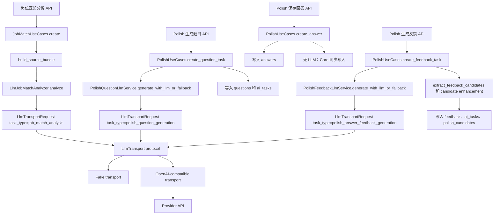

当前 direct-call 事实：

| 路径 | 当前调用方 | 当前 trace 行为 | 当前失败行为 |
|---|---|---|---|
| Job Match | `JobMatchUseCases._analyze_source_bundle` -> `JobMatchAnalyzer.analyze` | `LlmTransportResult.trace_refs` 和 result payload metadata；作为 `JobMatchAnalysis` 字段持久化 | provider unavailable 映射为 `provider_unavailable`；invalid output 映射为 `validation_failed`；无 runtime replay |
| Polish question | `PolishUseCases.create_question_task` -> `PolishQuestionLlmService` | question metadata 包含 LLM generation metadata 和 evidence refs；task 存为 succeeded | feature disabled / real provider disabled / validation failure 会 fallback 到 deterministic draft |
| Polish feedback | `PolishUseCases.create_feedback_task` -> `PolishFeedbackLlmService` | feedback metadata 包含 generation 和 validation details；candidates 单独持久化 | schema / consistency / raw payload failure 进入 fallback 或 validation error；不自动创建 formal objects |
| Progress tree | `PolishProgressTreeV2Pipeline` task types 经 LLM transport 或 fake outputs 执行 | progress plan/state 持久化到 polish session detail | insufficient context / failed artifacts 使用显式状态表达 |
| Pressure / Report / Review | None | N/A | 仅 skeleton |

## 5. 当前数据与持久化边界（AS-IS）

当前持久化以 Core Business 为中心。它已经具备 owner-scoped business tables、`ai_tasks` / `ai_task_results`、`trace_refs`、`evidence_refs`、`user_confirmations`、candidate tables、score tables、report/review skeleton tables 和 training tables。它尚未具备 graph execution 所需的 AI Runtime tables。

当前数据事实：

| 边界 | 当前状态 |
|---|---|
| Core business truth | Resume、Job、Binding、InterviewSession、Question、Answer、Feedback、Score、Report、Review、Weakness、Asset、Training models 是业务持久化 |
| 当前 AI task | `ai_tasks` 和 `ai_task_results` 表达 API task status/result handoff，不表达 graph run/node lifecycle |
| 当前 trace/evidence | `trace_refs` 和 `evidence_refs` 是通用 typed refs，不编码 per-node LLM lifecycle |
| 当前 candidates | `polish_candidates`、`weakness_candidates`、`asset_candidates`、training candidate fields 已存在；confirmation 仍是 domain-specific 或 planned |
| Missing runtime persistence | `agent_runs`、`agent_node_runs`、`agent_interrupts`、`agent_checkpoint_refs`、`llm_calls`、`llm_call_payloads` 均不存在 |
| Checkpoint | 当前没有 LangGraph checkpoint store |

当前持久化边界能支撑 AS-IS direct AI features，但不足以支撑 MultiAgent execution，因为它无法证明 node-level idempotency、interrupt/resume、checkpoint non-truth-source、replay policy、per-call trace lifecycle 或 graph handoff validation。

## 6. 当前架构问题总结（AS-IS）

当前问题不是 LLM 使用完全失控；现有代码已经在 owner scope、validation、redaction、fallback 和 import boundaries 上有有效控制。问题在于这些控制分散在每条 direct path 内，无法自然扩展到 LangGraph MultiAgent execution。

关键缺口：

| 缺口 | 影响 | 目标解决方式（TO-BE） |
|---|---|---|
| 无 Agent Runtime API | 前端无法统一观察 run/node/timeline/interrupt | 在 PR3/PR4/PR7 增加 AI Control Plane 和 sanitized status/timeline API |
| 无 node lifecycle | 无法证明 retry、side-effect idempotency 或 partial graph failure | 增加 `agent_node_runs` 和 side-effect keys |
| 无 persisted LLM call lifecycle | 无法回答每次调用何时、何处、如何 planned、started、succeeded 或 failed | 通过 `PersistedLlmTransport` 增加 `llm_calls` / `llm_call_payloads` |
| 无 checkpoint boundary | 未来 graph replay 可能误把 checkpoint 当业务事实 | 只存 checkpoint refs；业务读取使用 Core tables |
| direct feature-specific candidates | 不同功能的 candidate confirmation 不一致 | 标准化 CandidateEnvelope、InterruptRequest 和 HandoffRequest |
| Pressure placeholder | Pressure 无法支持 turn loop、pace、score 或 report handoff | 后续作为 business graph 实现，不进入 PR2 |
| Report/Review skeleton | Report/Review 无法运行 worker/reducer 或 copy/privacy gates | 在 PR8 graph package 中实现 |
| package-local architecture drift risk | Function packages 可能重新定义术语 | 本文拥有定义和 invariants |

## 7. 目标总体架构原则（TO-BE）

目标架构采用 ADR-0005 Option C：在现有单后端服务内引入 LangGraph-first Agentic Workflow Runtime。目标是对称双域架构，不是让所有业务功能排队等待一个纵向大 graph。

原则：

| 原则 | 规则 |
|---|---|
| 单服务，双域 | 保持 FastAPI backend；在其中增加 AI Runtime domain |
| Core 不依赖 LangGraph | Core use cases 只看 facade / ports / DTOs |
| Runtime 不是业务事实源 | AgentRun、NodeRun、timeline 和 checkpoint refs 不替代 business tables |
| Graph 产出 candidates 和 refs | Graph nodes 可以产出 candidate/suggestion/validation/trace/interrupt，不得 silent formal write |
| Formal write 经过 Core | 只有 Core command、显式 API action 或 user confirmation 能写 formal objects |
| Raw-off | Prompt、completion、provider payload、system prompt、token、cookie、secret 和 hidden scoring rule 不进入 logs、API、checkpoint 或 normal trace |
| Owner scope everywhere | API、facade、graph tools、runtime repositories 和 Core commands 都强制 owner/scope |
| PR migration is staged | PR2 inert data foundation；PR3 facade/ports；PR4 runtime adapter；PR5-PR8 graph migration |
| Legacy remains until parity | direct call paths 只在 graph parity 和 tests 通过后 wrap 并 deprecate |

## 8. 目标双域对称架构（TO-BE）

目标是在同一个 backend 内形成两个对等域：

| 域 | 拥有职责 | 不拥有职责 |
|---|---|---|
| Core Business Domain | user/business facts、formal objects、API business responses、candidate confirmation commands、copy boundary、source availability | LangGraph imports、checkpoint payload、graph node state、provider payload |
| AI Runtime Domain | agent run/node/interrupt/checkpoint refs、sanitized timeline、LLM call summaries、graph orchestration metadata、runtime idempotency | formal business facts、report body as truth、weakness/asset/training formalization |

### 目标双域架构图（TO-BE symmetric dual-domain architecture）

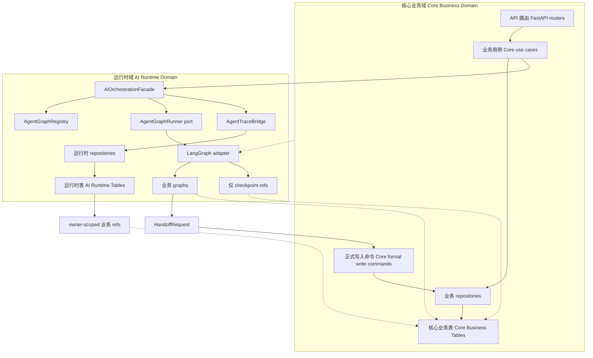

## 9. AI Runtime planes

AI Runtime 拆成控制、配置、业务图和资产 plane，使 implementation 可以分阶段评审，避免 control state、configuration management、business graph logic 和 AI assets 混在一起。

| Plane | 拥有职责 | 示例 | PR 归属 |
|---|---|---|---|
| AI Control Plane | run/node/interrupt/checkpoint refs、facade、runner port、registry、side-effect guard、trace bridge、timeline、retry/cancel/replay policy | `AgentRunRepository`, `AgentGraphRunner`, `AgentInterruptService`, `AgentSideEffectGuard` | PR2 foundation、PR3 contracts、PR4 adapter |
| Graph Configuration Plane | graph descriptors、config schema、enablement/default-off policy、placeholder registry、policy refs、admin/owner config audit | `GraphDescriptorService`, `GraphConfigRepository`, `GraphConfigAuditService` | PR6 backend config API；PR7 frontend config console |
| AI Business Graph Plane | feature graphs、graph state schema、nodes、tools、validators、quality gates 和 handoff plans | `job_match_graph`, `polish_question_graph`, `pressure_interview_graph`, `report_generation_graph` | PR5-PR8 |
| AI Asset Plane | prompt assets、evaluation fixtures、skill taxonomy、evidence/source refs、LLM transport wrappers、redaction 和 release policy | `PROMPT_ASSET_SPEC.md`, `PROMPT_EVALUATION_SPEC.md`, `SKILL_MODEL_SPEC.md`, `PersistedLlmTransport` | PR2 trace schema / repositories；PR3 trace context contract；PR4 concrete wrapper；PR5+ business adoption |

### Directory boundary

| Boundary | Rule |
|---|---|
| Business graph topology root | 业务 graph 拓扑、node descriptor、edge descriptor、state schema 和 graph package DTO 只能定义在 `apps/api/app/application/ai_runtime/business_graphs/<feature>/**`（逻辑路径 `application/ai_runtime/business_graphs/<feature>/**`） |
| Business graph import rule | `application/ai_runtime/business_graphs/<feature>/**` 不得 import `langgraph`、`langchain`、provider SDK、SQLAlchemy、FastAPI 或 infrastructure concrete adapter |
| Concrete compile root | `StateGraph` / LangGraph compile、checkpointer、serializer 和 concrete adapter 只能放在 `apps/api/app/infrastructure/ai_runtime/langgraph/**` |
| PR2 restriction | PR2 不创建 `business_graphs/<feature>`，不创建 concrete LangGraph adapter，不创建 runtime flags |
| PR3 / PR4 split | PR3 可定义 application contracts / descriptors；PR4 才能在 infrastructure root 编译 fake graph runtime |

### AI Runtime plane 架构图

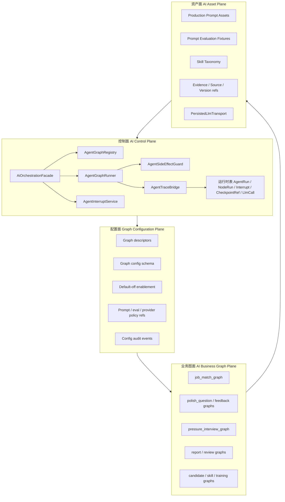

## 10. Core Business Domain 与 AI Runtime Domain 边界

该边界是 application-level protocol boundary，不是 service-to-service business writes。AI Runtime 可以请求 handoff；Core 决定是否以及如何写入 formal business facts。

| 关注点 | Core Business Domain | AI Runtime Domain |
|---|---|---|
| Formal object | 拥有 `Question`, `Feedback`, `ScoreResult`, `InterviewReport`, `Weakness`, `Asset`, `TrainingRecommendation`, `TrainingTask` | 只能提出 candidate/suggestion/result refs |
| AI task status | 拥有 API-visible `AiTask` protocol 和 domain endpoint compatibility | 拥有 AgentRun/NodeRun/timeline internals，并映射回 sanitized status |
| Source reads | 带 owner checks 读取 business tables | 通过 owner-scoped refs 请求 tools；不得 direct broad table scan |
| LLM calls | 定义允许的 business input refs 和 contract ids | 记录 call lifecycle 和 payload policy |
| Checkpoint | 不从 checkpoint 读取业务事实 | 只保存 checkpoint ref metadata |
| Confirmation | 拥有 user confirmation 和 Core command transaction | 创建 interrupt 和 candidate drawer payload |
| 失败 | 保持 business consistency 和 visible status | formal write 前 fail closed；记录 runtime failure |

### Transaction boundary

| Transaction | Owner | Rule |
|---|---|---|
| Runtime run/node transaction | AI Runtime repository | `agent_runs`、`agent_node_runs`、`agent_interrupts`、`agent_checkpoint_refs` 的状态变更必须短事务提交；不得把 provider call 包在同一个 DB transaction 内 |
| LLM trace transaction | `PersistedLlmTransport` / trace repository | provider call 前必须先写 planned/running `llm_calls`；before-call trace write fail 时不得调用 provider |
| Core formal write transaction | Core Business command / repository | `Question`、`Feedback`、`ScoreResult`、`Report`、`Review`、`Weakness`、`Asset`、`Training*` formal writes 必须由 Core command 独立提交，并受 owner / version / confirmation / side-effect key 校验 |
| Handoff transaction | `AgentPersistenceHandoff` + Core command | handoff 只能携带 refs、summaries、validation result 和 `side_effect_key`；Core command 失败时 runtime 标记 partial/failure，不重放 provider payload |
| Interrupt resume transaction | `AgentInterruptService` | resume 必须 owner-scoped、base-version checked、idempotency-hash checked；重复 resume 只能返回同一结果或 stale/conflict |
| Replay transaction | Runtime replay policy | debug replay 默认 read-only；未显式授权时不得触发 provider call 或 Core formal write |

## 11. Agent / Graph / Node / Tool / Validator / QualityGate / Handoff 定义

| 术语 | 定义 | 硬边界 |
|---|---|---|
| Agent | 一个具名 capability worker，具有 protocol contract、graph membership、prompt / tool scope 和 handoff policy | Agent 不是 business service，不能直接写 formal objects |
| Graph | 由 nodes、edges、conditional routes 和 interrupt points 组成的 LangGraph workflow，面向一个业务功能或子功能 | Graph state 是 runtime state，不是 business truth |
| Node | 一个确定性或 AI-backed execution step，声明 inputs、outputs、side effects 和 idempotency key | Node output 必须先通过 validators / quality gates 才能 handoff |
| Tool | 暴露给 graph node 的 bounded function，用于读取 owner-scoped refs 或请求 Core command | Tool 不得绕过 Core ownership 或写 hidden formal objects |
| Validator | schema、semantic、evidence、redaction、score 或 source-availability check | Validator failure 阻断 formal write 并返回 status |
| QualityGate | 业务级 decision，用于 accept、repair、downgrade、interrupt 或 reject node result | QualityGate 不得 silent coerce low-confidence output 为 high-confidence formal result |
| Handoff | 从 AI Runtime 到 Core Business command 或 user confirmation flow 的 protocol message | Handoff 携带 refs、summaries 和 validation，不携带 raw provider payload |

### AgentState definition

`AgentState` 是 business graph 的 runtime state contract，不是 API schema、不是 Core business object、不是 checkpoint 业务事实源。Application 层只能定义 state contract / DTO / descriptor；concrete LangGraph state compile 只能发生在 `infrastructure/ai_runtime/langgraph/**`。

| Field group | Required content | Forbidden content |
|---|---|---|
| Ownership | `owner_id`, `actor_id`, `ai_task_id`, `agent_run_id`, `graph_name`, idempotency key hash | cross-owner refs |
| Business refs | resume/job/session/question/answer/feedback/report/review/candidate refs, version refs, source availability flags | raw resume body, raw JD, raw answer body unless explicitly display-safe |
| Runtime refs | current node, completed node refs, interrupt refs, checkpoint ref, side-effect keys | checkpoint payload as business read model |
| Validation | `validation_status`, `confidence_level`, `low_confidence_flags`, failure category, retry policy | hidden success, silent low-confidence coercion |
| Trace / evidence | `trace_refs`, `evidence_refs`, `llm_call_refs`, sanitized summaries and hashes | raw prompt, raw completion, provider payload, system prompt, token, cookie, secret |
| Output refs | candidate refs, suggestion refs, formal refs only after Core handoff | direct formal object mutation from graph node |

## 12. MultiAgent 通信协议

MultiAgent communication 通过 envelopes 和 refs 协议化。Agents 不通过修改彼此的 business tables 互相调用；它们通过 AI Control Plane 发布 state patches、candidate envelopes、validation results、interrupts 和 handoff requests。

| Contract | 字段 | 生产者 | 消费者 | 持久化 | 校验 | 说明 |
|---|---|---|---|---|---|---|
| `AgentCommandEnvelope` | `owner_id`, `actor_id`, `ai_task_id`, `agent_run_id`, `graph_name`, `command_type`, `input_refs`, `idempotency_key_hash`, `trace_context` | Core facade | Agent graph runner | `agent_runs.input_refs_json` | owner、source availability、command schema | 启动或恢复 graph，且不让 LangGraph types 泄漏到 Core |
| `AgentStatePatch` | `agent_run_id`, `node_name`, `input_digest`, `output_digest`, `status`, `trace_refs`, `evidence_refs`, `low_confidence_flags` | Graph node | Control plane / timeline | `agent_node_runs` | digest present、no raw state | patch，不是完整 AgentState payload |
| `NodeResultEnvelope` | `node_name`, `result_type`, `result_refs`, `candidate_refs`, `suggestion_refs`, `validation_result_ref`, `confidence_level` | Graph node | Validator / QualityGate | `agent_node_runs.output_digest` + typed refs | schema、semantic、evidence | validation 通过后才能喂给下一个 node |
| `ToolCallRequest` | `tool_name`, `owner_scoped_refs`, `purpose`, `requested_fields`, `redaction_profile` | Graph node | Tool adapter / Core read port | runtime tool event summary | owner/scope、least privilege | 禁止 full table scan 或 raw source dump |
| `ToolCallResult` | `tool_name`, `result_refs`, `displayable_summary`, `source_availability`, `trace_refs` | Tool adapter | Graph node | trace refs 和 node summary | no raw prompt/provider/secrets | summary 只有在允许时才能进入 prompt |
| `ValidationResultEnvelope` | `schema_id`, `validation_status`, `errors`, `repairable`, `fallback_reason`, `low_confidence_flags` | Validator | QualityGate / facade / API mapper | validation refs / runtime node summary | deterministic validator | 区分 schema、semantic、evidence 和 redaction failures |
| `QualityGateDecision` | `decision`, `accepted_refs`, `rejected_refs`, `next_action`, `user_visible_status`, `retryable` | QualityGate | Graph router / facade | node status 和 task result | policy-specific | decision 包括 accept、partial、low_confidence、interrupt、reject、fail_closed |
| `CandidateEnvelope` | `candidate_id`, `candidate_type`, `status`, `source_refs`, `evidence_refs`, `trace_refs`, `confidence_level`, `merge_key`, `base_candidate_version_ref` | Business graph 或 candidate graph | Candidate confirmation graph / Core candidate store | candidate table 或 runtime candidate ref | candidate schema、owner、no formal intent | confirmation 前 formal object 必须为 null |
| `InterruptRequest` | `interrupt_id`, `interrupt_type`, `resume_schema_id`, `candidate_refs`, `prompt_summary`, `allowed_actions`, `base_version_ref` | Graph / QualityGate | Frontend interrupt UI 和 facade resume | `agent_interrupts` | sanitized drawer payload、owner、schema | 用于 approval、edit、reject、merge、request_more_evidence |
| `HandoffRequest` | `handoff_type`, `validated_result_refs`, `candidate_refs`, `target_command`, `confirmation_ref`, `trace_refs`, `side_effect_key` | Graph / AgentPersistenceHandoff | Core command | pending write / side-effect record | side-effect guard、confirmation、version | 只有这条路径可以请求 Core 写 formal objects |
| `LlmTraceContext` | `owner_id`, `ai_task_id`, `agent_run_id`, `agent_node_run_id`, `contract_ids`, `prompt_version`, `schema_id`, `replay_mode` | Control plane / graph node | Persisted LLM transport | `llm_calls` | missing owner/task/node blocks capture | migration 期间也以 nullable `agent_*` 包装 legacy direct calls |
| `FailureEnvelope` | `failure_point`, `provider_called`, `business_write_allowed`, `runtime_write_required`, `user_status`, `retry_policy` | 任意 node / transport / validator | Facade / API mapper / runbook | runtime failure summary | failure matrix | 防止 hidden success 和 late formal write |

### Interrupt taxonomy

| Interrupt type | Trigger | Allowed actions | Formal write allowed before resume | PR |
|---|---|---|---|---:|
| `approval_required` | candidate / suggestion 需要用户确认后才能写 formal object | approve, reject, skip | No | PR4 contract；PR8 broad closure |
| `edit_before_formal_write` | 用户可编辑 candidate 内容再确认 | approve_edited, reject, request_more_evidence | No | PR7 UI；PR8 closure |
| `merge_decision` | candidate 与既有 Weakness / Asset / Training suggestion 可能重复 | merge, keep_separate, reject | No | PR8 |
| `request_more_evidence` | evidence_refs 不足、source unavailable 或 low confidence | request_more_evidence, retry, cancel | No | PR5+ feature graph |
| `stale_version_conflict` | base version 已变化或 confirmation ref 过期 | reload, retry_with_latest, cancel | No | PR4+ |
| `low_confidence_review` | QualityGate 不能安全自动接受 | accept_low_confidence, retry, reject | No unless Core command explicitly allows accepted risk | PR5+ |
| `provider_failure_retry` | provider unavailable / timeout / rate limit 且 retryable | retry, fallback, cancel | No | PR4+ |
| `manual_stop` | 用户或系统取消 in-flight run | cancel, rollback_to_legacy_status | No | PR4+ |

### Agent 协作与 Handoff 流程图

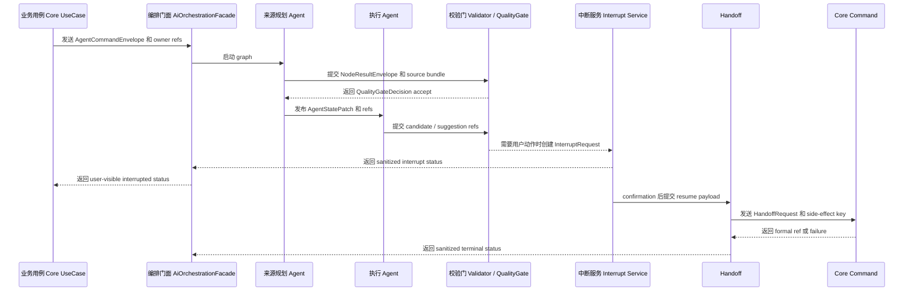

## 13. Feature-to-Agent 映射

Feature-to-Agent mapping 是架构映射，不是实现授权。PR2 不得创建 `application/ai_runtime/business_graphs/<feature>/**`。每个目标 Agent 必须遵守上文的 planes 和 contracts。

成熟度规则：

| 规则 | 结论 |
|---|---|
| Immediate business graph migration | 只允许 PolishAgent 作为第一批真实业务 graph migration target |
| Immature Agent capabilities | JobMatchAgent、ResumeAnalysisAgent、PressureAgent、ReportAgent、ReviewAgent、AssetAgent、WeaknessAgent、TrainingAgent 只能先以 backend stubs、descriptors、DTOs 或 graph placeholders 表达，不得在 dedicated migration PR 前完整实现 |
| PR2 boundary | PR2 仍只做 inert runtime data model / repository / tests；不得创建 business graph、不得启用 LangGraph runtime |
| Priority order | 先切换 LangGraph runtime foundation，再迁移 Polish mode；Pressure 和 Training 不得阻塞 Polish migration |

### Feature-to-Agent 映射图

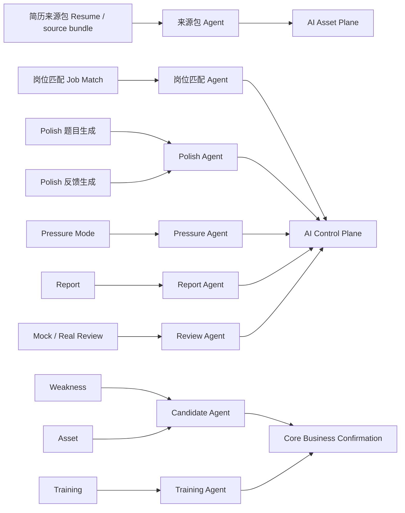

| 业务功能 | 当前实现 | 目标 Agent | 目标 Graph | Plane | 输入 | 输出 | Handoff | Priority | Migration Stage | Migration Status | Implementation Maturity |
|---|---|---|---|---|---|---|---|---|---|---|---|
| Resume source bundle | `build_source_bundle`、resume Markdown chunks；没有 standalone graph | ResumeAnalysisAgent / Source Bundle descriptor | `resume_analysis_graph` placeholder only | AI Business Graph Plane + AI Asset Plane | `ResumeVersion`、markdown digest、section refs | source bundle refs、evidence refs、quality flags | 只给 Job Match / Polish / Report 提供 refs | P2 | PR8 deferred / conditional graph migration | PR2-PR7 descriptor / placeholder / direct path retention / config registry metadata only | Direct helper exists；Agent capability immature |
| Job match analysis | `JobMatchUseCases.create` + `LlmJobMatchAnalyzer.analyze` | JobMatchAgent | `job_match_graph` placeholder only | AI Business Graph Plane | binding、resume/job versions、score rule、source bundle | `JobMatchAnalysis`、`ScoreResult(job_match)`、candidate refs | validation 后由 Core write；candidates 保持 pending | P2 | PR8 deferred / conditional graph migration | PR2-PR7 descriptor / trace-compatible wrapper / placeholder / direct path retention / config registry metadata only | Direct feature exists；完整 graph migration 不进入 immediate priority |
| Polish progress tree | `PolishProgressTreeV2Pipeline` 和 progress plan/state JSON | Polish Planning Agent | `polish_progress_tree_graph` | AI Business Graph Plane | polish session、evidence chunks、turns summary、Skill refs | progress plan/state refs、low confidence flags | Core 只更新 progress state | P0 | PR5 Polish migration first | PR5 first migration target | Mature enough for first real business graph migration |
| Polish question | `PolishUseCases.create_question_task` + `PolishQuestionLlmService` | Polish Question Agent | `polish_question_graph` | AI Business Graph Plane | session、progress node、completed refs、anti-repeat refs | question ref、evidence refs、task result | quality gate 后由 Core 写 `Question` | P0 | PR5 Polish migration first | PR5 first migration target | Mature question code and tests |
| Polish answer save | `PolishUseCases.create_answer` | None；Core sync action | N/A | Core Business Domain | session、question、answer text、idempotency key | `Answer` | Direct Core write；无 graph 且无 LLM | P0 guardrail | 保持在 graph 外 | Not migrated | 已成熟 Core action；不得 graph 化 |
| Polish feedback | `PolishUseCases.create_feedback_task` + feedback LLM + candidate extraction | Polish Feedback Agent | `polish_feedback_graph` | AI Business Graph Plane | answer/question/session refs、previous feedback、score rule | feedback、score candidate、loss points、candidate refs | Feedback/score 经 Core；candidates pending confirmation | P0 | PR5 Polish migration first；candidate enhancement / formal closure PR8 | PR5 feedback graph；candidate enhancement and formal closure deferred to PR8 | Mature feedback/candidate extraction path；formal write 仍需 confirmation |
| Pressure mode | `PressureUseCases.bootstrap`、router/schema placeholder | PressureAgent | `pressure_interview_graph` placeholder only | AI Business Graph Plane | pressure session、turns、pace、skill gaps、source refs | opening、questions、quality、pace、end、score、report input package | report/review/candidate refs；不生成 report body | P3 | PR8 or dedicated Pressure PR | Deferred to PR8 / dedicated authorization；descriptor / DTO / placeholder before then | Later independent interview-mode agent；不得阻塞 Polish migration |
| Report generation | `ReportUseCases.bootstrap`、report models only | ReportAgent | `report_generation_graph` placeholder only | AI Business Graph Plane | report input package、score refs、session refs | report sections、score explanation、copy metadata | Core writes report；强制 copy boundary | P3 | PR8 closure | Deferred to PR8 closure | Skeleton only；dedicated PR 前只允许 descriptor / DTO / placeholder |
| Mock review | `ReviewUseCases.bootstrap`、review model only | ReviewAgent | `mock_review_generation_graph` placeholder only | AI Business Graph Plane | session/report/turn/score refs | review items、weakness/asset/training candidates | candidates pending confirmation | P3 | PR8 closure | Deferred to PR8 closure | Skeleton only；dedicated PR 前只允许 descriptor / DTO / placeholder |
| Real review | 无完整 runtime；real review model fields planned | ReviewAgent | `real_review_generation_graph` placeholder only | AI Business Graph Plane | user-confirmed real input、redacted evidence、job/resume refs | real review、review items、candidate refs | privacy gate 后由 Core 写 review | P3 | PR8 closure | Deferred to PR8 closure | Immature runtime；dedicated PR 前只允许 descriptor / DTO / placeholder |
| Weakness candidate | Polish candidate extraction；`WeaknessCandidate` model | WeaknessAgent / Candidate Agent | `weakness_candidate_graph` placeholder only | AI Business Graph Plane + Asset Plane | feedback/score/review evidence、existing weaknesses | weakness candidates、merge suggestions | formal Weakness 前必须 confirmation interrupt | P3 | PR8 Candidate / Skill / Training closure | Deferred to PR8 closure | Candidate foundation exists；WeaknessAgent immature |
| Asset candidate | `Asset` / `AssetVersion` models；skeleton use case | AssetAgent / Candidate Agent | `asset_candidate_graph` placeholder only | AI Business Graph Plane + Asset Plane | answers、feedback、assets、evidence refs | asset candidates、version suggestions | formal Asset / AssetVersion 前必须 confirmation | P3 | PR8 Candidate / Skill / Training closure | Deferred to PR8 closure | Skeleton only；dedicated PR 前只允许 stub / descriptor / DTO |
| Training suggestion | `TrainingUseCases` explicit list/dismiss/start/complete | TrainingAgent | `training_suggestion_graph` placeholder only | AI Business Graph Plane + Asset Plane | confirmed weaknesses、assets、score trends、training history | training recommendation candidates、ranking hints | TrainingTask 前必须 explicit user action | P3 | PR8 Training closure | Deferred to PR8 closure | Downstream closure / recommendation graph；不是 Polish peer prerequisite |
| Candidate confirmation | legacy polish candidate endpoints 和 planned confirmation refs | Confirmation Agent | `candidate_confirmation_interrupt_graph` | AI Control Plane + Core Business Domain | candidate refs、action、version、edited payload | formal ref 或 rejected/skipped status | confirmation 后只能经 Core command | P3 | PR8 Candidate / Skill / Training closure | Deferred to PR8 closure | Runtime confirmation pattern 后置；不得提前 formal write |

### Polish / Pressure / Training 关系

| Agent | 关系定位 | 对 Polish migration 的影响 | 迁移规则 |
|---|---|---|---|
| PolishAgent | 当前 primary migration target；覆盖 question、feedback、progress tree 的 first real business graph migration | 必须优先迁移；以现有成熟 Polish mode 代码为 graph parity 基线 | PR5 先迁移 Polish question / feedback / progress tree；answer save 保持 Core sync action |
| PressureAgent | 后续独立 interview-mode agent；服务 Pressure Mode turn loop、pace、score 和 report input package | 不得阻塞 Polish migration；不得被当作 Polish 前置依赖 | Dedicated Pressure PR 或 PR8 后置实现；迁移前只保留 descriptor / DTO / placeholder |
| TrainingAgent | 下游 closure / recommendation graph；消费 skill gaps、weakness candidates、review/report findings 和 user confirmation | 不是 Polish 的 peer prerequisite；不参与 Polish first migration gating | PR8 Candidate / Skill / Training closure 后置实现；TrainingTask 仍必须由显式用户动作触发 |

## 14. LLM trace persistence 架构

LLM trace persistence 必须回答每次 provider attempt 的五个问题：谁请求了调用、使用了哪些业务 refs 和 contracts、provider execution 何时 started/finished、出现了什么 validation/failure result、是否允许 business write。

规则：

| 方面 | 架构规则 |
|---|---|
| 时机 | provider call 前写 planned/running；provider returns 或 raises 后立即写 success/failure；validators / quality gates 后写 validation 和 handoff |
| 位置 | PR2 runtime tables：`llm_calls` 和 `llm_call_payloads`；graph context 还关联 `agent_runs` 和 `agent_node_runs`；legacy direct calls 在 migration 期间使用 nullable run/node refs |
| 方式 | `PersistedLlmTransport.generate(request, trace_context)` 包装现有 `LlmTransport`；记录 sanitized summaries 和 hashes，默认不保存 raw payload |
| 失败行为 | before-call write 失败时在 provider 前 fail closed。provider 失败时记录 failure 且不允许 business write。after-success trace write 失败时阻断 formal write，直到 trace recovered 或 accepted risk 已登记。validation 失败时 runtime trace 必须存在且拒绝 business formal write |
| Raw payload | 默认 raw disabled。debug raw ref 若未来获授权，必须有 feature flag、encryption、TTL 和 audit；不得进入 API/log/checkpoint/copy content |

`PersistedLlmTransport` 归属：

| PR | Ownership |
|---|---|
| PR2 | 只创建 `llm_calls` / `llm_call_payloads` schema、repository 和 redaction/idempotency tests；不实现 runtime wrapper |
| PR3 | 定义 `LlmTraceContext`、trace bridge contract、facade/port DTO 和 legacy trace-compatible calling contract |
| PR4 | 实现 concrete `PersistedLlmTransport` wrapper、LangGraph/fake runtime trace wiring 和 sanitized timeline mapping |
| PR5+ | 按 feature graph adoption 使用 wrapper；PR5 Polish，PR8 JobMatch / ResumeAnalysis and remaining conditional migrations |

### LLM trace persistence hook matrix

| 当前路径 | 当前调用方 | 未来包装器 | Trace Context 来源 | 调用前写入 | 成功后写入 | 失败后写入 | PR |
|---|---|---|---|---|---|---|---|
| Job Match direct analyzer | `LlmJobMatchAnalyzer.analyze` | 注入的 `LlmTransport` 外包 `PersistedLlmTransport` | Core `AiTask` + legacy `task_type=job_match_analysis`；graph migration 前没有 node ref | `llm_calls(status=running, contract_ids=P-JOBMATCH-*)` | model、usage if available、request/response hash、validation summary、evidence hash | provider failure category、fallback/retry policy、no business write | PR2 schema；PR8 deferred / conditional graph adoption |
| Polish question direct path | `PolishQuestionLlmService.generate_with_llm_or_fallback` | `PersistedLlmTransport` | `AiTask`、session/question request refs、contract ids | planned/running call summary | accepted/fallback metadata、validation status、evidence refs | fallback reason 和 deterministic result marker | PR2 schema；PR5 adoption |
| Polish feedback direct path | `PolishFeedbackLlmService.generate_with_llm_or_fallback` | `PersistedLlmTransport` | `AiTask`、answer/question/session refs、feedback schema id | planned/running call summary | score/candidate validation summary、low confidence flags | schema/consistency/raw leak failure | PR2 schema；PR5 adoption |
| Candidate LLM enhancement | `candidate_llm.py` service | `PersistedLlmTransport` | feedback/candidate refs、candidate type | planned/running call summary | candidate-only summary | partial candidate enhancement failure、no formal write | PR2 schema；PR8 adoption |
| Job Match graph node | `run_job_match_analyzer` node | `PersistedLlmTransport` | `AgentRunContext` + `AgentNodeRun` | node-linked running call | node output refs and validation | node failed；side effect blocked | PR8 deferred / conditional |
| Polish graph node | `generate_question_candidate` / `generate_feedback_candidate` | `PersistedLlmTransport` | `AgentRunContext` + node descriptor | node-linked running call | candidate refs / question refs / feedback refs | graph route to fallback、interrupt 或 failure | PR5 |
| Pressure graph node | `generate_opening` / `generate_follow_up_question` / score | `PersistedLlmTransport` | `AgentRunContext` + pressure turn refs | node-linked running call | pressure question/quality/pace/score refs | visible `generation_failed` / `low_confidence`；no late write | PR8 |
| Report / Review workers | report/review worker nodes | `PersistedLlmTransport` | worker section/node refs | worker running call | section/review summary 和 quality gate | required worker fail 时 report fail；optional worker fail 时 partial | PR8 |

### Trace failure matrix

| 失败点 | Provider 是否已调用 | 是否允许业务写入 | Runtime 写入要求 | 用户可见状态 | Retry / Replay |
|---|---|---|---|---|---|
| Trace context 缺少 owner 或 task | No | No | optional audit failure | `validation_failed` | fix caller；no replay |
| Before-call `llm_calls` write fails | No | No | audit/event if possible | `generation_failed` 或 `trace_unavailable` | runtime repo 恢复后 retry |
| Provider configuration error | No | No | 若 planned row exists，则写 `llm_calls.failed` | `generation_failed` / `provider_unavailable` | config fixed 后才 retry |
| Provider timeout / rate limit | Yes | No formal write | `llm_calls.failed` with category | `provider_unavailable` / `timed_out` | 在 idempotency key 下 retryable |
| Provider success but JSON parse fails | Yes | No | success response hash + validation failure | `validation_failed` | retry 或 fallback；no formal write |
| Schema validation fails | Yes | No | validation result ref | `validation_failed` | repairable 时 retry |
| Semantic/evidence validation fails | Yes | candidate only if safe | validation result + low confidence flags | `low_confidence` / `validation_failed` | manual correction 或 retry |
| After-success trace write fails | Yes | No new formal write | failure audit required | `generation_failed` / `partial` | 仅当 sanitized summary recoverable 时 replay provider result |
| Checkpoint write fails | Maybe | policy 决定前不允许 graph handoff | checkpoint ref failure | `generation_failed` / `partial` | resume blocked；debug replay only |
| Handoff formal write fails | Maybe | transaction rolled back | pending write failed | `partial` / `generation_failed` | 使用相同 side-effect key retry handoff |
| Replay attempts formal write | debug replay 不调用 provider | No | replay blocked summary | `replay_blocked` | read-only replay only |

## 15. Legacy direct LLM 调用路径

Legacy direct paths 在 graph replacements 通过 parity 之前仍有效。Deprecation policy 是先 wrap、再 migrate、最后 remove。用 persisted trace 包装 direct paths 不得改变 API response shape，也不得静默启用 graph runtime。

### Legacy direct call 的 LLM trace persistence 时序

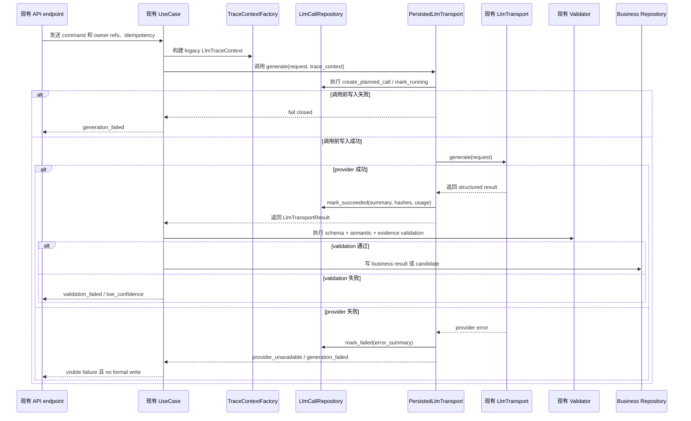

Legacy direct path 约束：

| 约束 | 规则 |
|---|---|
| No graph enablement | wrapping transport 不创建 graph runner、checkpoint 或 business graph |
| No response shape drift | 当前 API contracts 保持兼容，直到 feature graph PR 在 scope 内修改 |
| No raw payload | 现有 no-log/no-response raw rules 继续生效；trace 只存 summaries 和 hashes |
| No late formal write | provider success 后如 trace 或 validation 失败，formal write 必须阻断 |
| No hidden provider smoke | real provider calls 仍由现有 explicit gates 控制 |

## 16. LangGraph graph node 的 LLM 调用路径

Graph node calls 使用同一个 `PersistedLlmTransport`，但 trace context 包含 `agent_run_id` 和 `agent_node_run_id`。Validators 和 quality gates 必须在任何 Core handoff 之前运行。

### Graph node call 的 LLM trace persistence 时序

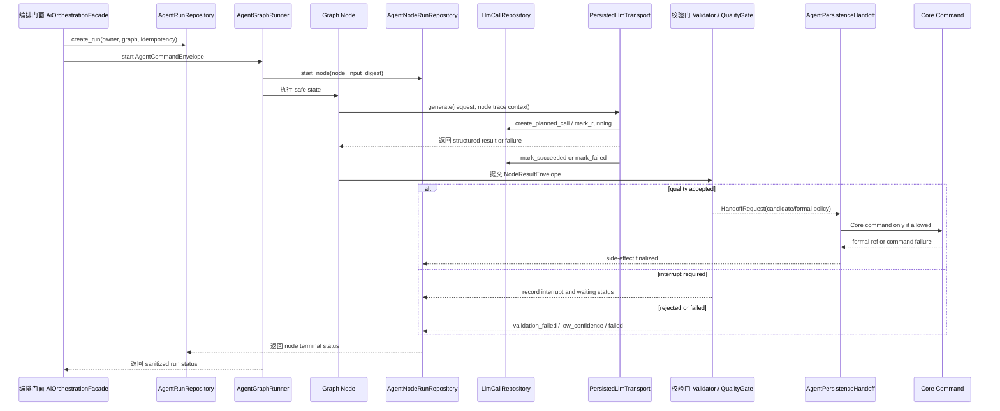

Graph node path 约束：

| 约束 | 规则 |
|---|---|
| Node state | Graph state 只持有 refs、summaries、validation flags 和 low confidence flags，不持有 raw source bodies |
| Tools | Tool reads 必须 owner-scoped，并只返回 displayable summaries / refs |
| Quality gates | QualityGate 必须在 side effects 和 Core handoff 之前运行 |
| Interrupt | Human decision 使用 `agent_interrupts`；frontend 只能看到 sanitized drawer payload |
| Replay | Debug replay 默认 read-only，除非显式授权；replay 不得 formal write |

## 17. 数据边界（Data boundary）

Data boundary 有三个区。Runtime tables 可以引用 Core business tables，但不能替代它们。Checkpoint refs 可以引用 runtime rows，但 checkpoint payload 不能成为 business read model。

### 数据边界图

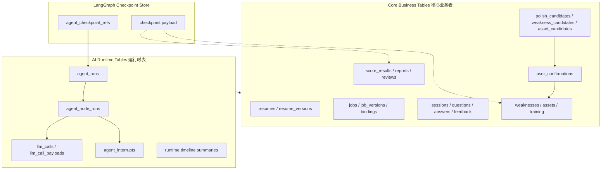

数据规则：

| 规则 | 必须行为 |
|---|---|
| Core tables | 继续作为 user-visible facts、formal objects、reports、reviews、score results 和 confirmed training 的 source of truth |
| Runtime tables | 存储 execution status、node status、interrupts、LLM summaries、pending writes 和 checkpoint refs |
| Checkpoint | 只存 runtime recovery data；不得用于组装 business response 或 copy content |
| Candidate | Candidate tables / refs 可由 graph 产出，但 formal objects 必须经过 confirmation/Core command |
| LLM payload | `llm_call_payloads.raw_enabled=false` by default；normal API 和 timeline 只见 sanitized summary |
| Owner | 每个 runtime row 都必须有 owner scope，或能 join 到 owner-scoped task/run；不得 cross-owner timeline |
| PR2 | 只能添加 inert runtime data/repository/tests；不得 graph execution、runtime flags 或 dependency |

## 18. 前端运行时边界（Frontend runtime boundary）

LangGraph orchestration 不需要一个普通用户可见的“编排页面”。Frontend 只接收 sanitized runtime status 和 business refs，用轻量 runtime surfaces 承接业务流程中的状态、timeline、interrupt/resume 和 candidate confirmation。它不渲染 AgentState、checkpoint payload、prompt、completion、provider payload 或 hidden scoring internals。PR7 默认承接 frontend runtime UI；PR2-PR6 backend docs 不授权 frontend edits。

### LangGraph orchestration 页面边界

| 边界 | 结论 |
|---|---|
| Normal user-facing orchestration page | 不需要；不得把 LangGraph graph、node、checkpoint 或 AgentState 作为普通用户页面概念暴露 |
| Required runtime surfaces | AI task status、sanitized agent run timeline、interrupt / resume、candidate confirmation、low confidence / validation failed banners |
| Optional debug surface | 仅允许 dev-only 或 admin-only debug panel，且必须经过单独授权、权限门禁和 sanitized schema |
| Forbidden raw exposure | 不得暴露 raw prompt、raw completion、provider payload、checkpoint payload 或完整 AgentState |

### 前端运行时边界图

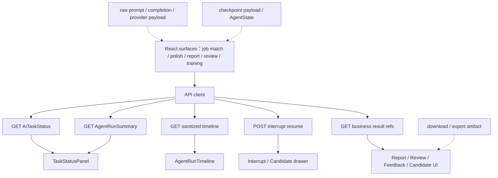

前端边界规则：

| 界面 | 允许 | 禁止 |
|---|---|---|
| Task status | queued/running/partial/low_confidence/validation_failed/source_unavailable/generation_failed/timed_out/cancelled | 把 low confidence 当作 success |
| Timeline | sanitized node events、model summary、validation summary、trace ids | AgentState、checkpoint payload、prompt、completion、provider payload |
| Interrupt / candidate drawer | candidate refs、evidence summary、allowed actions、base version | silent formal write、hidden confirmation、raw source body |
| Report / review copy | 通过 owner/copy boundary checks 后的 clipboard content | export/download/file artifact 或 hidden scoring rule |
| Polling | default polling with terminal stop | 未单独授权和测试的 streaming/SSE |
| Dev/admin debug panel | sanitized run summary、node ids、status、duration、validation summary | raw prompt、raw completion、provider payload、checkpoint payload、完整 AgentState |

## 19. 迁移路线（Migration roadmap）

迁移分阶段推进，确保 direct paths 在 graph parity 被证明前保持稳定。最高优先级是先完成 LangGraph runtime foundation，再迁移 Polish mode。PR2 仍保持 `CONDITIONAL GO`，不授权 runtime enablement。

### Legacy-to-LangGraph 迁移路线图

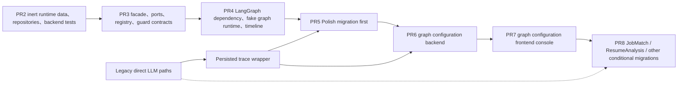

| 阶段 | 目标 | 代码变更 | Runtime 状态 | Legacy Path | 退出标准 |
|---|---|---|---|---|---|
| PR2 | Inert AI Runtime persistence foundation | 只在 exact scope 内添加 runtime data model、repositories、backend tests | Runtime default-off；无 graph、无 facade、无 LangGraph dependency | direct paths 不变 | schema/import/bootstrap/repository/redaction/idempotency/boundary tests 通过；no runtime enablement；`CONDITIONAL GO` 不扩大 |
| PR3 | Facade / Agent protocol / fake runner | 增加 `application/ai_runtime/**` facade、Agent protocol、registry、trace bridge、guard、interrupt/handoff contracts 和 fake runner | 可创建 project DTOs 并校验 policies；无 concrete LangGraph | direct paths 可被 wrapped，不替换 | Core 只 import facade/ports/protocol DTOs；无 LangGraph types leak |
| PR4 | LangGraph dependency + fake graph runtime | 显式授权后添加 LangGraph dependency、`infrastructure/ai_runtime/langgraph/**` adapter、fake graph runtime、checkpoint refs、timeline、interrupt/resume | Runtime 可 default-off 运行 fake graph | direct paths 不变 | dependency pinned；adapter imports isolated；fake start/resume/replay/timeline sanitized；checkpoint non-truth-source tests pass |
| PR5 | Polish migration first | 添加 Polish progress/question/feedback graphs、facade wiring 和 compatibility tests | Polish question/feedback/progress 可在 feature flag 下走 graph path | direct Polish path 保持到 parity；answer save remains no LLM | existing Polish API compatibility；anti-repeat/evidence/progress/candidate tests pass；Pressure/Training 不参与 gating |
| PR6 | Graph configuration backend | 添加 graph descriptor API、graph config schema、graph enablement/default-off config API、placeholder graph registry、prompt/eval/provider policy refs、admin/owner scope 和 config audit | Graph Configuration Plane 可配置但默认关闭；不执行业务 graph | direct paths 不变 | config API sanitized；default-off；owner/admin scoped；no provider call；no raw/debug internals |
| PR7 | Graph configuration frontend console | 添加 graph list、graph detail/config page、enable/disable form、policy refs display、placeholder graph view、sanitized health/status/audit view | UI 消费 PR6 config/status/audit API | existing UI behavior preserved | no raw fields、no Agent debug page for normal users、no backend graph logic、no provider secret/model key exposure |
| PR8 | JobMatch / ResumeAnalysis / Pressure / Report / Review / Candidate / Skill / Training conditional migrations | 按授权迁移业务 graph，并补 report/review/candidate/skill/training confirmation closure | MultiAgent 覆盖 late MVP graphs | remaining direct paths either deprecated or documented fallback after parity | report/review/candidate/copy/privacy gates pass；no silent formal write；TrainingTask requires explicit user action |

### PR3 / PR4 Runtime Contracts gate

PR3 / PR4 只把 AI Runtime contract、facade、runner port、default-off fake runtime、checkpointer / serializer、timeline 和 interrupt/resume 接入到可验证边界。它们不授权 business graph migration、frontend UI、real provider default-on、migration、CI 或 PR5+ formal write implementation。

| Concern | Required architecture decision |
|---|---|
| Active docs backfill | `DATA_MODEL.md`、`PERSISTENCE_MODEL.md`、`SECURITY_PRIVACY.md`、`APPLICATION_FLOW_SPEC.md`、`API_SPEC.md` 必须先承接 runtime objects、persistence rules、raw-off、facade flow 和 Agent Runtime API skeleton |
| Handoff formal write | `AgentPersistenceHandoff` 在 PR3 / PR4 only contract / stub；`write_question_result`、`write_feedback_result`、`write_report_result`、`write_review_result`、`write_candidate_result`、`finalize_after_confirmation` 的真实 Core command path 是 PR5+ 或对应业务迁移 PR |
| Checkpointer / serializer | PR4 fake runtime 只能验证 checkpoint ref / metadata；serializer 必须拒绝 raw prompt、raw completion、provider payload、system prompt、secret、hidden scoring rule 和 full source body |
| Runtime API | status、timeline、interrupt detail、resume、cancel 只返回 sanitized refs / status / summary；不返回 AgentState、checkpoint payload、raw payload 或 debug raw refs |
| PR3 start condition | PR3 implementation may start only after a fresh PR3 Scope Lock confirms allowed files, no dirty scope mismatch, and validation commands |

## 20. Legacy deprecation policy

不能因为 graph 存在就删除 Legacy direct paths。只有在 graph parity 和 boundary tests 证明 graph path 至少同等安全、同等兼容后，才能按 feature deprecate。

| 阶段 | 策略 |
|---|---|
| Before PR2 | Legacy direct paths 仍是当前实现 |
| PR2 | Legacy paths 不变；runtime tables 是 inert |
| PR3 / PR4 | Legacy paths 只有在 scope 内才能使用 common DTOs 或 trace wrapper；不得行为变更 |
| PR5-PR7 | PR5 只迁移 Polish graph path；PR6 / PR7 只建立配置后端与配置控制台；legacy 仍是 fallback |
| PR8 | 才评估 JobMatch / ResumeAnalysis 及其他业务 graph 的 conditional migration；legacy deprecation 需逐 feature 证明 parity |
| Parity window | 比较 API shape、persistence、owner scope、validation、redaction、trace 和 candidate/formal boundaries |
| Deprecation | tests pass 且 rollback path exists 后，才能在 code/docs 标记 deprecated |
| Removal | direct path removal 必须单独 scoped PR；PR2 不允许 removal |

### In-flight legacy task policy

| Scenario | Policy |
|---|---|
| PR2 data foundation lands while legacy `AiTask` is running | Running legacy tasks continue on direct path；runtime tables remain inert and do not claim ownership |
| PR3 / PR4 trace wrapper is introduced | New calls may receive trace-compatible wrapper only under explicit scope；existing in-flight legacy tasks are not migrated mid-flight |
| PR5 Polish graph flag turns on | New Polish question / feedback / progress tree tasks may choose graph path under feature flag；existing direct Polish tasks finish direct or fail closed with existing status semantics |
| PR6 graph configuration backend | Direct path remains canonical；config registry metadata does not convert in-flight business tasks into graph runs |
| PR7 graph configuration frontend | Job Match direct path remains available；configuration console only reads sanitized descriptors/config/audit |
| Rollback from graph to direct path | In-flight graph runs must be cancelled, expired, or failed with sanitized status before fallback；no late formal write after rollback |
| Replay / retry | Retry uses same idempotency / side-effect key; debug replay is read-only unless separately authorized |

### Runtime feature flags

PR2 不得新增或启用 runtime feature flags。以下 flags 是 PR4+ / feature migration 的 target contract，默认 off，且必须有 tests 证明 raw-off、owner scope、rollback 和 no response drift。PR3 可定义 `runtime_flags.py` contract，但所有 runtime / graph flags 仍默认 false。

Flag resolution priority:

1. test override。
2. explicit environment / settings override。
3. persisted graph config if authorized in PR6+。
4. hardcoded default false。

Flag 读取边界：

- graph node 不直接读 flag。
- 只允许 facade / registry / runner entry 读取和解释 flag。
- enable decision 必须写 sanitized audit summary。
- real provider gate 独立于 graph enablement，默认 false。
- rollback disable 必须能让新请求回到 legacy direct path 或返回 sanitized disabled status，不能继续 provider call 或 late formal write。

| Flag | Earliest PR | Purpose | Default |
|---|---:|---|---|
| `AIFI_AI_RUNTIME_ENABLED` | PR4 | Enable AI Runtime facade/fake runtime status path | false |
| `AIFI_AI_RUNTIME_LANGGRAPH_ENABLED` | PR4 | Enable concrete LangGraph adapter / fake graph runtime | false |
| `AIFI_AGENT_TIMELINE_API_ENABLED` | PR4 / PR7 | Expose sanitized runtime timeline API / UI consumption | false |
| `AIFI_POLISH_GRAPH_ENABLED` | PR5 | Route new Polish progress/question/feedback tasks through graph path | false |
| `AIFI_GRAPH_CONFIG_API_ENABLED` | PR6 | Enable graph descriptor/config/audit API while configs remain default-off | false |
| `AIFI_GRAPH_CONFIG_CONSOLE_ENABLED` | PR7 | Enable AI Runtime graph configuration console | false |
| `AIFI_JOB_MATCH_GRAPH_ENABLED` | PR8 deferred / conditional | Route new JobMatch / ResumeAnalysis tasks through graph path after parity | false |
| `AIFI_RUNTIME_RAW_PAYLOAD_DEBUG_ENABLED` | Not in PR2-PR8 unless separately authorized | Allow encrypted/TTL raw debug refs under admin-only flow | false |

### GraphDescriptor DTO boundary

`GraphDescriptor` 是 AI Control Plane / Graph Configuration Plane 的 project-owned DTO，不包含 LangGraph internals、compiled graph、AgentState、checkpoint payload、provider secret、model key、raw prompt、raw completion 或 provider payload。

| Field | Rule |
|---|---|
| `graph_name` | stable graph id |
| `graph_version` | descriptor compatibility version |
| `capability` | registered capability |
| `lifecycle_status` | active / disabled / planned / placeholder / deferred |
| `runtime_flag_key` | resolved by facade / registry / runner entry only |
| `default_enabled` | false unless later PR explicitly authorizes enablement |
| `supported_entrypoints` | start / resume / replay / timeline |
| `supported_outputs` | result refs、candidate refs、suggestion refs、interrupt refs |
| `prompt_contract_ids` | canonical `P-*` contract ids |
| `eval_suite_ids` | prompt / graph evaluation suite refs |
| `resume_schema_ids` | interrupt resume schema refs |
| `interrupt_types` | registered interrupt taxonomy |
| `required_permissions` | owner/admin/user permissions |
| `visibility` | owner_only / admin_config / hidden_placeholder |
| `health_summary_refs` | sanitized refs only |
| `config_schema_ref` | PR6 graph config schema ref |
| `implementation_pr` | PR expected to implement/migrate |
| `migration_status` | not_started / direct_path_retained / parity_testing / migrated / rolled_back |

Current descriptor decisions:

- JobMatch / ResumeAnalysis are PR8 deferred / placeholder before explicit migration authorization.
- Polish may become active only after PR5 parity gates.
- Pressure belongs in PR8 or a separate authorized Pressure PR, not PR3 / PR4.
- PR3 / PR4 do not create `business_graphs` implementation.

禁止的 deprecation shortcuts：

| shortcut | 禁止原因 |
|---|---|
| 将所有 AI tasks 重定向到一个 generic graph | 隐藏 feature-specific validation，并破坏 AS-IS API compatibility |
| Treating checkpoint as result cache | 违反 checkpoint non-truth-source invariant |
| Removing deterministic fallback before graph fake tests exist | 破坏 local deterministic testing 和 provider gate |
| Auto-promoting candidates during migration | 违反 candidate/formal boundary |

## 21. 架构不变量（Architecture invariants）

| 不变量 | 强制方式 | 测试 | 违规示例 |
|---|---|---|---|
| Core Business 不 import LangGraph / LangChain | `application/ai_runtime` ports 与 `infrastructure/ai_runtime/langgraph` adapter 分离 | `test_architecture_boundaries.py`；future import scan for `langgraph` outside infra adapter | `PolishUseCases` imports `StateGraph` |
| API layer 不 import DB models 或 LLM infra | 沿用现有 API boundary rule | `test_architecture_boundaries.py` | `api/v1/report.py` imports `app.infrastructure.db.models.report` |
| Application layer 不 import infrastructure | 现有 application boundary rule 加 future runtime packages | `test_architecture_boundaries.py` | `application/ai_runtime/facade.py` imports SQLAlchemy session |
| Business graph topology root 隔离 | graph topology / descriptor / state contract 只能在 `apps/api/app/application/ai_runtime/business_graphs/<feature>/**`，且不得 import `langgraph` / `langchain` | PR3+ forbidden import scan | `business_graphs/polish/question_graph.py` imports `StateGraph` |
| LangGraph concrete import root 隔离 | PR4 授权后只能在 `apps/api/app/infrastructure/ai_runtime/langgraph/**` compile `StateGraph` / concrete adapter | PR4+ forbidden import scan | `application/ai_runtime/business_graphs/job_match.py` imports `langgraph` |
| PR2 remains default-off | PR2 不添加 runtime flags、graph runner、adapter、dependency 或 business graph | PR2 exact tests + import scan | PR2 adds `runtime_flags.py` or `job_match_graph.py` |
| Checkpoint is not business truth | 只存 checkpoint refs；Core 读取 business tables | checkpoint payload forbidden tests | Report assembled from checkpoint payload |
| Raw payload is off by default | redaction policy、`llm_call_payloads.raw_enabled=false`、logging sanitizer | redaction scan、transport tests | API response includes `provider_payload` |
| Before-call trace write fails closed | `PersistedLlmTransport` 要求 provider 前已有 planned/running call row | LLM trace repository failure test | Provider called after `llm_calls` insert failed |
| Formal write requires Core command or confirmation | `AgentPersistenceHandoff` + `AgentSideEffectGuard` | candidate/formal negative tests | Graph node inserts `Weakness` directly |
| Candidate remains candidate until user action | `CandidateEnvelope`、confirmation interrupt、user confirmation ref | candidate confirmation tests | `AssetCandidate` creates `AssetVersion` without confirmation |
| Owner scope is mandatory across runtime and tools | runtime rows 上有 owner field，且 tool ports owner-scoped | owner isolation tests | Timeline returns another user's node event |
| MultiAgent communication is protocolized | §12 envelope tables；禁止 ad hoc service write | contract tests for envelopes | Report agent mutates Training repository directly |
| Frontend receives sanitized runtime only | API schemas 排除 AgentState/checkpoint/raw fields | frontend type tests and route/API tests | Timeline event includes prompt text |
| Low confidence is visible | API status 和 runtime timeline 保留 `low_confidence` | API/UI low-confidence tests | Graph maps low confidence to success with no flags |
| No export/download scope expansion | 只保留 copy boundary | route inventory no export/download | Report graph returns `download_url` |

## 22. 本架构如何约束 backend function packages

Backend function packages 是 implementation guidance。它们不能重新定义本文的 architecture terms、planes、protocols 或 invariants。当 package 需要 Agent、Graph、Node、Tool、Validator、QualityGate、Handoff、CandidateEnvelope 或 LlmTraceContext 等术语时，必须使用本文定义。

| Package | 必须引用本文内容 | 可在本地定义 | 不得重新定义 |
|---|---|---|---|
| `01_AI_RUNTIME_INFRA_PACKAGE.md` | AI Control Plane、domain boundary、protocol envelopes、invariants | method names、class files、port signatures | Core/LangGraph dependency direction、checkpoint truth semantics |
| `02_LLM_TRACE_PERSISTENCE_PACKAGE.md` | LLM trace architecture、hook matrix、failure matrix、data boundary | table fields、repository methods、PR2 tests | raw-off policy、before-call fail-closed rule、PR2 default-off |
| `03_JOB_MATCH_AGENT_PACKAGE.md` | Feature-to-Agent map、PR8 deferred / conditional priority、legacy direct path policy | descriptors、DTOs、placeholder graph names；PR8 授权后才定义 graph nodes、idempotency keys、parity tests | Job Match as immediate migration target、separate architecture 或 formal Weakness write |
| `04_POLISH_AGENT_PACKAGE.md` | Polish first migration target、answer-save no-LLM boundary、candidate/formal invariant | graph node plan、migration mapping、parity tests | Answer save as graph/LLM side effect |
| `05_PRESSURE_AGENT_PACKAGE.md` | Pressure target graph、PR2 exclusion、data/frontend boundaries | pressure turn node details | Pressure graph in PR2 或 report body generation in Pressure graph |
| `06_REPORT_REVIEW_AGENT_PACKAGE.md` | Report/Review feature mapping、copy/no-export、privacy 和 candidate boundaries | worker/reducer nodes、partial policy | hidden scoring exposure、direct TrainingTask 或 formal Weakness write |
| `07_CANDIDATE_SKILL_TRAINING_PACKAGE.md` | CandidateEnvelope、InterruptRequest、HandoffRequest、Skill/Asset plane boundaries | candidate schemas、merge keys、confirmation node plan | direct formal write from graph replay 或 automatic TrainingTask creation |
| `08_GRAPH_CONFIGURATION_PACKAGE.md` | Graph Configuration Plane、default-off、policy refs、admin/owner config audit | descriptor/config DTOs、API method plan、audit event shape | business graph execution、provider call、LangGraph debug internals |

Package review checklist：

| 检查项 | 必须结果 |
|---|---|
| Architecture vocabulary | 使用本文术语，且不为 planes/protocols 引入平行命名 |
| PR scope | 不扩大 `02_BACKEND_REFACTOR_MASTER_PLAN.md` 中的 PR phase |
| Data boundary | 只写该 PR 授权的 runtime/core tables |
| Trace | 说明 `LlmTraceContext` 在何处创建并持久化 |
| Handoff | 说明 output 是 candidate、suggestion、interrupt 还是 formal Core command |
| Tests | 将 package 触及的每个 invariant 映射到 tests 或 explicit deferred risk |

## 23. 完成定义（Definition of Done）

本文完成条件如下：

| 要求 | 本文证据 |
|---|---|
| 本文是 LangGraph MultiAgent implementation 的 canonical technical architecture | §1 |
| AS-IS 反映真实代码成熟度，包括 Pressure placeholder 和 Report / Review skeleton | §2, §3, §4 |
| AS-IS LLM direct paths 已记录 | §4, §15 |
| TO-BE 不是纵向长链条 | §7, §8, §9, §13 |
| AI Control Plane、AI Business Graph Plane 和 AI Asset Plane 已分离 | §9 |
| Core Business Domain 与 AI Runtime Domain 边界明确 | §8, §10, §17 |
| Agent / Graph / Node / Tool / Validator / QualityGate / Handoff 已定义 | §11 |
| MultiAgent communication 已协议化 | §12 |
| Feature-to-Agent map 已存在 | §13 |
| LLM trace persistence 说明 when、where、how 和 failure behavior | §14, §15, §16 |
| Legacy direct call path 和 graph node call path 均已覆盖 | §15, §16 |
| Data 和 frontend runtime boundaries 已覆盖 | §17, §18 |
| 迁移路线包含 phase exit criteria | §19 |
| Legacy deprecation policy 已存在 | §20 |
| Architecture invariants 可强制 | §21 |
| Backend function packages 受本文架构约束 | §22 |
| PR2 status 保持清晰 | §1, §19, §21 |

PR2 verdict：`CONDITIONAL GO` 仍然有效。本文未发现新的 blocker。既有条件保持不变：PR2 只限于 exact scope lock 内的 inert AI Runtime data model / repository / backend tests；不得启用 LangGraph runtime、graph execution、real provider call、business graph migration、runtime facade / adapter、frontend UI、dependency install、migration 或 PR2 scope expansion。
