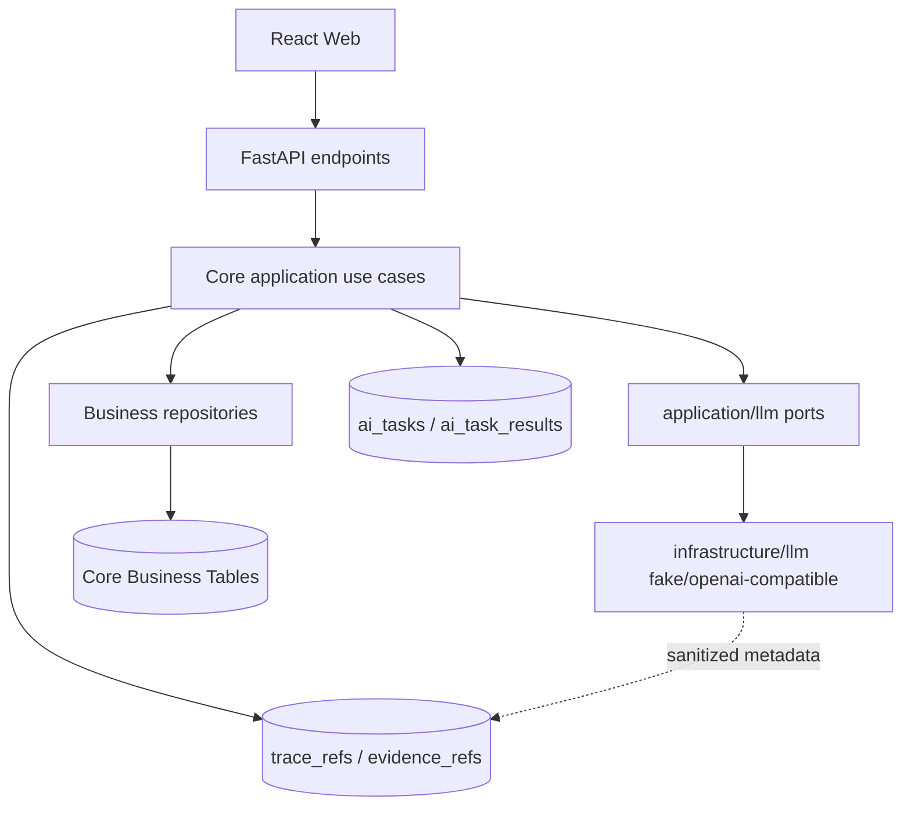
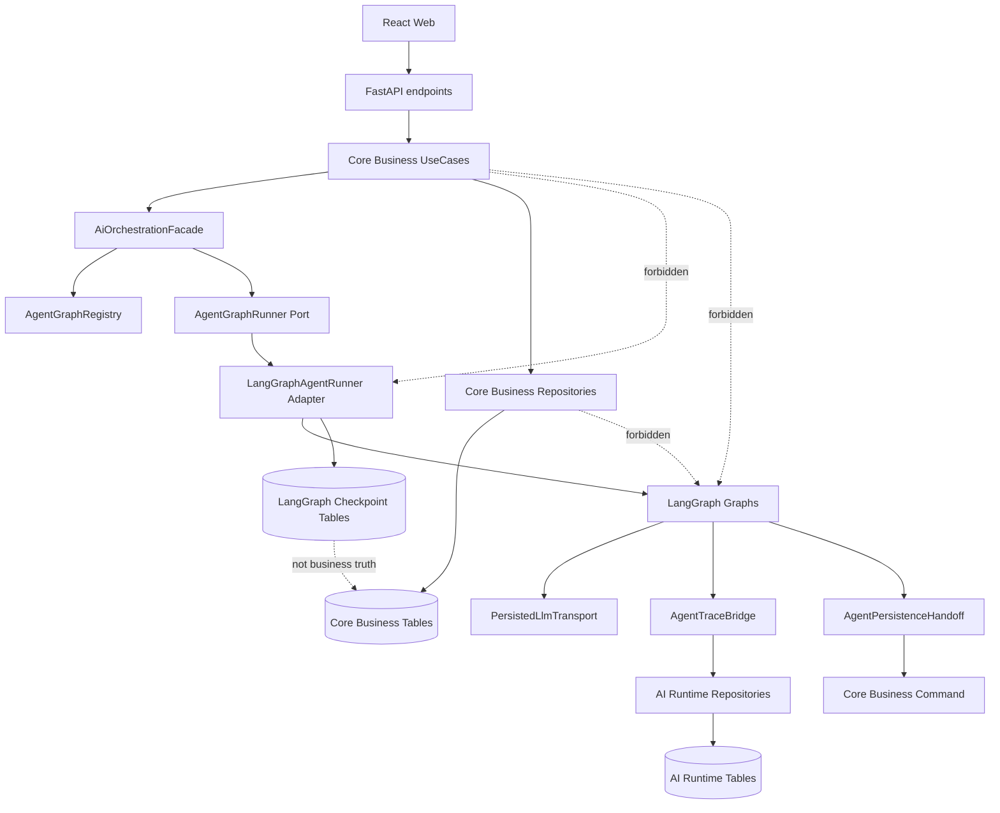
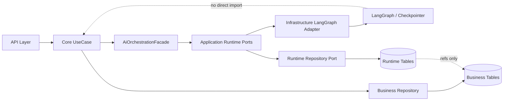
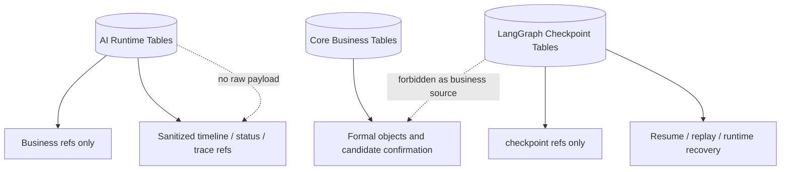
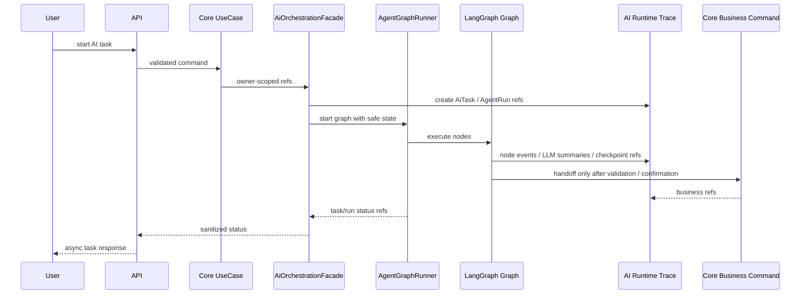
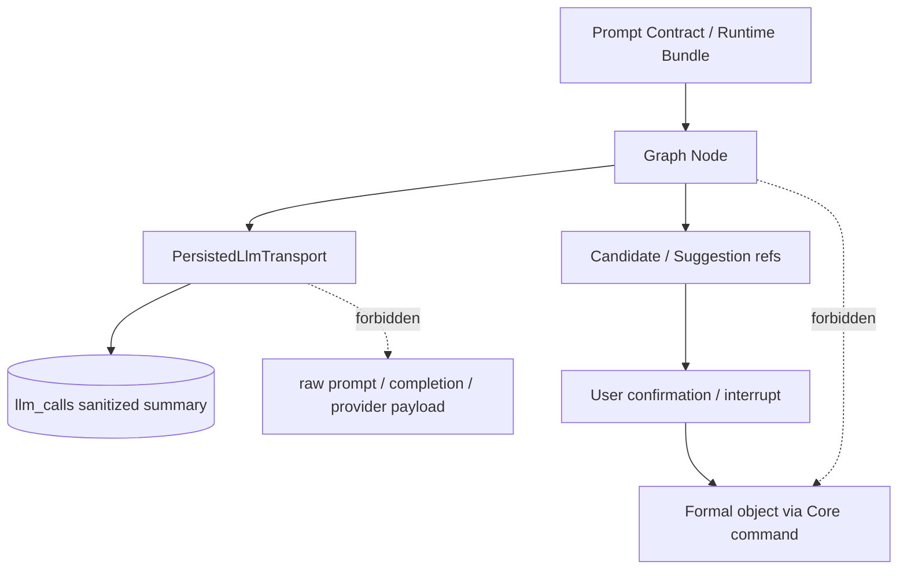

# LangGraph MultiAgent Architecture As-Is To-Be

## 1. 文档目的

本文只承载 LangGraph MultiAgent consolidation 的架构 as-is / to-be 与架构图。PR 顺序、迁移总计划、字段级表设计、方法级实现计划和前端状态机不在本文维护。

## 2. As-Is 摘要

当前仓库已有 application / infrastructure 分层、LLM transport port、OpenAI-compatible transport、fake transport、AI task、trace/evidence、candidate/formal boundary 和 architecture boundary tests。当前代码没有 LangGraph 依赖。

当前缺口：

- 没有统一 Agent Runtime API。
- 没有 `AgentGraphRunner` port 与 concrete LangGraph adapter。
- 没有 `agent_runs`、`agent_node_runs`、`agent_interrupts`、`agent_checkpoint_refs`、`llm_calls`、`llm_call_payloads` 的统一运行时数据层。
- 没有统一 sanitized timeline、interrupt/resume、checkpoint ref 和 replay/resume write policy。
- Job Match、Polish、Pressure、Report、Review、Candidate / Skill / Training 分散在现有服务、prompt contract 和 planning 文档中。

## 3. To-Be 摘要

目标架构采用单后端微服务内双域：

- Core Business Domain 继续承载业务事实、业务 API、formal object、candidate confirmation 和用户可见业务结果。
- AI Agentic Workflow Runtime Domain 承载 agent run、node run、interrupt、checkpoint ref、LLM trace、graph execution metadata 和 sanitized timeline。

Core Business 不直接依赖 LangGraph、AgentState、graph node、checkpoint schema 或 provider payload。Core UseCase 只通过 `AiOrchestrationFacade` / `AgentGraphRunner` port 触达 AI Runtime。

## 4. 架构图

### 4.1 As-Is 架构

### 4.2 To-Be 双域架构

### 4.3 依赖方向

### 4.4 三类表边界

### 4.5 Runtime event flow

### 4.6 Prompt / Trace / Candidate boundary

## 5. 固定架构规则

| 规则 | 结论 |
|---|---|
| Core Business 依赖 | 不依赖 LangGraph、LangChain、AgentState、checkpoint schema、provider payload |
| LangGraph import root | 只能在 `apps/api/app/infrastructure/ai_runtime/langgraph/**` |
| Application runtime root | `apps/api/app/application/ai_runtime/**` |
| Business graph root | `apps/api/app/application/ai_runtime/graphs/**`，PR5-PR8 才能按 domain 创建 |
| Checkpoint | 只用于 resume / replay / runtime recovery，不是 business truth source |
| Raw payload | 默认不保存、不进日志、不进 checkpoint、不进 API response、不进普通 trace |
| Formal write | 只能由 Core command、用户确认或显式业务 API 写入 |
| PR2 | 只允许 inert runtime data model / repository / backend tests |

## 6. 与旧目录关系

旧 `docs/03-delivery/refactor-multiagent-langgraph/` 中的 architecture options、recommended architecture、target directory structure 和 ADR 相关内容只作为本文 evidence 来源。实施时以本文和根 README 的 source-of-truth 边界为准。
