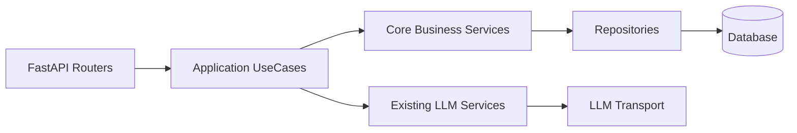
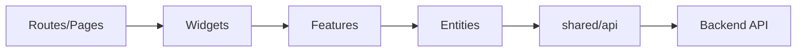

# SubAgent Recon 汇总报告

## 1. 文档目的

本文件记录 PR1 SubAgent-assisted 只读 recon 的职责分工、主要发现、冲突和主 Agent 决策。它用于给后续 PR2-PR8 提供上下文，但不替代 active docs，也不把 SubAgent 草稿直接提升为事实源。

## 2. 输入来源

- SubAgent A：Docs Governance Agent 只读输出。
- SubAgent B：Architecture Skeleton Agent 只读输出。
- SubAgent C：Backend Runtime Skeleton Agent 只读输出。
- SubAgent D：Graph Plans Skeleton Agent 只读输出。
- SubAgent E：Frontend / Testing / Validation Skeleton Agent 只读输出。
- 主 Agent 已读取的 active docs：`DOCS_INDEX.md`、`BACKLOG.md`、`APPLICATION_FLOW_SPEC.md`、`PERSISTENCE_MODEL.md`、`DATA_MODEL.md`、`PROMPT_SPEC.md`、`SCORING_SPEC.md`、`SECURITY_PRIVACY.md`、`API_SPEC.md`、`UX_SPEC.md`、`UI_DESIGN_SYSTEM.md`、`prompt-contracts/*.md`。
- 临时输入：`docs/tmp/CODEX_LANGGRAPH_MULTIAGENT_README.md`、`docs/tmp/CODEX_LANGGRAPH_AI_NON_AI_BOUNDARY.md`。

## 3. 当前状态

SubAgent 只允许读取、起草和检查，不允许写文件。最终写入由主 Agent 串行完成。本轮没有执行 PR2-PR8 的实现、测试编写、migration、provider 调用、commit 或 push。

Plan mode 核心结论已纳入本文件：

- 采用 LangGraph-first / Option C。
- 单微服务双域：Core Business 与 AI Runtime 在同一后端内分层隔离。
- Core Business 不依赖 LangGraph。
- Core UseCase 只通过 `AiOrchestrationFacade` 触达 AI Runtime。
- LangGraph checkpoint 不是业务事实源。
- AI Runtime 需要 agent run、node run、interrupt、LLM trace、checkpoint ref 和 sanitized timeline。
- candidate / suggestion 不得静默升级为 formal object。
- raw prompt、raw completion、provider payload 不进入日志、checkpoint 或 API response。

## 4. 目标输出

本文件输出：

- SubAgent A-E 职责回顾。
- 每个 SubAgent 已发现事实。
- 当前模块图、LLM 调用点、AI task/trace/evidence/audit 模型、测试覆盖矩阵占位。
- 缺口分类。
- SubAgent 冲突与主 Agent 决策。
- `TBD by PR2/PR3` 的明确范围。

## 5. 必须覆盖范围

### 5.1 SubAgent A-E 职责回顾

| SubAgent | 职责 | 输出摘要 |
|---|---|---|
| A Docs Governance | 查找 docs index / backlog，分析登记风格和治理风险 | 确认 `DOCS_INDEX.md` 与 `BACKLOG.md` 路径，建议新增 AIFI 任务并登记专题包 |
| B Architecture | 起草 README、Option、推荐架构、目录结构 | 建议 Option C、双域架构、facade、checkpoint 非事实源 |
| C Backend Runtime | 起草 runtime、LLM trace、data、API 骨架 | 建议 `AiOrchestrationFacade`、`AgentGraphRunner`、`PersistedLlmTransport`、runtime 表 |
| D Graph Plans | 起草 06-09 graph plans | 覆盖 resume/job match/polish/report/review/weakness/asset/training/confirmation graph |
| E Frontend / Testing | 起草 12-17 frontend/test/validation/PR breakdown | 覆盖 AI task UI、timeline、interrupt、candidate confirmation、PR1-PR8 验证 |

### 5.2 SubAgent 已发现事实

| 来源 | 已发现事实 | 主 Agent 处理 |
|---|---|---|
| A | `docs/tmp` 只能作为输入，不是事实源 | 在 README、DOCS_INDEX 和各文档关系章节重复声明 |
| A | 专题包不能替代 active canonical docs | 在 `DOCS_INDEX.md` 登记为专题设计包 |
| A | 建议新增 `AIFI-BE-002` | 采用，范围限定为 PR1 文档登记与设计包骨架 |
| B | Option C 最能支撑 graph/runtime/trace/interrupt 长期演进 | 采用为推荐架构 |
| B | ADR 可能需要后续创建 | PR1 不创建 ADR，只登记为后续候选 |
| C | runtime 需要 facade、runner port、LangGraph adapter、trace bridge | 纳入 04、05、10、11 |
| C | API_SPEC 需由主 Agent 补读 | 主 Agent 已补读，11 仍标记后续 contract 需正式回写 |
| D | Graph 草案中的部分节点名与用户指定清单不同 | 正式文档按用户指定节点名冻结，SubAgent 草案只作为素材 |
| E | 当前前端测试以类型/契约为主，PR7 若引入 runner 需单独授权 | 纳入 14、17 风险与 PR7 scope |

### 5.3 当前后端模块图占位

TBD by PR2/PR3：补齐现有 `application/ai_tasks`、`application/llm`、`application/polish`、`infrastructure/llm` 与新 `application/agents` 的迁移映射。PR1 先冻结“不直接让 Core Business import LangGraph”的边界，因此不影响 PR1 验收。

### 5.4 当前前端模块图占位

TBD by PR7：确认是否引入测试 runner、mock server 和 AI Runtime UI feature flag。PR1 只冻结目标目录与 UI 状态边界，不写前端代码。

### 5.5 当前 LLM 调用点清单占位

| 类别 | 当前来源 | PR1 结论 | TBD |
|---|---|---|---|
| Job Match | active prompt contracts 与后端 job match 链路 | 后续归入 `job_match_graph` | PR5 精确 recon |
| Polish Question | `PolishQuestionLlmService` 相关链路 | 后续经 facade 迁移 | PR6 精确 recon |
| Polish Feedback | `PolishFeedbackLlmService` 相关链路 | answer save 不触发 LLM，feedback 独立 AI task | PR6 精确 recon |
| Report / Review | active contracts 已定义 Draft | 后续归入 report/review graphs | PR8 精确 recon |
| Weakness / Asset / Training | candidate / suggestion contracts | 只生成候选或建议 | PR8 精确 recon |

### 5.6 当前 AI task / trace / evidence / audit 模型清单占位

| 模型类别 | 当前 active 来源 | PR1 规划缺口 |
|---|---|---|
| `AiTask` / `AiTaskResult` | `DATA_MODEL.md`、`PERSISTENCE_MODEL.md`、`APPLICATION_FLOW_SPEC.md` | 缺 agent run / node run / interrupt 映射 |
| `TraceRef` / `EvidenceRef` | `DATA_MODEL.md`、`PERSISTENCE_MODEL.md` | 缺 LLM call 与 graph node 细粒度 trace |
| candidate / suggestion | `DATA_MODEL.md`、`PROMPT_SPEC.md`、prompt contracts | 缺 confirmation interrupt / resume 通用模型 |
| audit | `SECURITY_PRIVACY.md`、`PERSISTENCE_MODEL.md` | 缺 agent runtime audit event 计划 |

### 5.7 成熟度矩阵占位

| 领域 | 当前成熟度 | PR1 结论 | 补齐 PR |
|---|---|---|---|
| report | active prompt/API/data 有 Draft | 需要 graph worker/fanout/fanin 设计 | PR8 |
| review | active prompt/API/data 有 Draft | 需要 mock/real 分流和真实输入确认 | PR8 |
| weakness | candidate/formal 边界已有 | 需要 confirmation interrupt | PR8 |
| asset | candidate/formal 边界已有 | 需要 confirmation drawer 与 audit | PR8 |
| training | suggestion/formal 边界已有 | 需要 explicit API / confirmation | PR8 |

### 5.8 当前测试覆盖矩阵占位

| 测试类别 | 当前线索 | 缺口 |
|---|---|---|
| Backend architecture boundary | 已有 `test_architecture_boundaries.py` | 需增加 Core 不 import LangGraph 断言 |
| LLM transport | 已有 LLM runtime/transport 类测试线索 | 需增加 persisted transport 和 raw-off scan |
| Job match / Polish | 已有业务 API 测试线索 | 需迁移到 graph handoff 后保持兼容 |
| Frontend | 当前以类型/编译门为主 | 需 AI task/timeline/interrupt/candidate UI 测试骨架 |
| Docs governance | 已有 doc governor | PR1 需跑最小文档门禁 |

### 5.9 缺口分类

| 缺口 | 说明 | 补齐 PR |
|---|---|---|
| agent runtime 缺口 | 缺 facade、runner port、adapter、registry、trace bridge | PR2-PR4 |
| LLM trace 持久化缺口 | 缺 `llm_calls`、payload policy、sanitized summary API | PR2-PR4 |
| LangGraph checkpoint 缺口 | 缺 checkpoint ref、checkpointer factory、replay/resume 策略 | PR4 |
| 前端 runtime UI 缺口 | 缺 task status、timeline、interrupt、candidate confirmation UI | PR7 |
| 测试脚本缺口 | 缺 graph runner、redaction、timeline、candidate closure tests | PR2-PR8 |
| 文档缺口 | 长期事实尚未回写 active docs / ADR | PR2-PR8 |

### 5.10 SubAgent 冲突与主 Agent 决策

| 冲突 / 差异 | 主 Agent 决策 |
|---|---|
| 用户文字写“18 个文档”，清单实际包含 19 个文件 | 按完整清单创建 19 个文件，避免遗漏 `00_SUBAGENT_RECON_REPORT.md` |
| SubAgent A 建议 `AIFI-BE-002` 优先级可用 SHOULD | 采用 SHOULD；PR1 是专题规划，不直接声明 MVP 发布阻断 |
| SubAgent B 提到 ADR | PR1 不写 ADR，后续如 Option C 长期固化再走受权 ADR |
| SubAgent C 标题与用户指定标题不完全一致 | 正式文档使用用户指定标题 |
| SubAgent D 部分 graph 节点名不同 | 正式文档使用用户指定节点名，并保留额外节点为补充 |
| SubAgent E 指出前端无真实 runner | PR7 需单独决策是否引入 Vitest/RTL/MSW/Playwright |

## 6. 与 active docs 的关系

本 recon 报告仅记录本轮只读发现和规划判断。任何长期事实必须回写到 active docs；任何历史材料只能通过 `REQUIREMENT_TRACEABILITY.md` 或 `archive/MANIFEST.md` 追踪，不能从本文件反向绕过 active docs。

## 7. 非目标

- 不完整重做全仓 recon。
- 不修改业务代码、测试、依赖或 migration。
- 不把 SubAgent 草稿原文作为正式规范。
- 不把 `docs/tmp` 提升为 canonical。
- 不确认真实 LangGraph / provider 选型细节。

## 8. 后续 PR 使用方式

- PR2/PR3 必须补齐 backend runtime 精确 recon：现有 `AiTask`、LLM service、repository、API router 的迁移点。
- PR4 必须补齐 LangGraph checkpointer、fake graph 和 trace bridge 的实现证据。
- PR5/PR6/PR8 必须按业务 graph 做逐链路 recon，不得只引用本 PR1 skeleton。
- PR7 必须补齐前端测试 runner 与 API contract 是否稳定的决策。

## 9. Definition of Done

- SubAgent A-E 输出已被归并。
- 冲突已由主 Agent 决策。
- AI / 非 AI 双域边界已明确。
- PR2/PR3 TBD 范围具体到 runtime/facade/data/API。
- 本报告明确自身不是 active canonical docs。

