# 推荐架构：LangGraph-first Agentic Workflow Runtime

## 1. 文档目的

本文固化 PR1 推荐架构骨架：在单后端微服务内建立 Core Business 与 AI Runtime 双域，用 `AiOrchestrationFacade` 隔离业务用例与 LangGraph runtime。

## 2. 输入来源

- `docs/tmp/CODEX_LANGGRAPH_MULTIAGENT_README.md`
- `docs/tmp/CODEX_LANGGRAPH_AI_NON_AI_BOUNDARY.md`
- `01_ARCHITECTURE_OPTIONS.md`
- active design docs：`APPLICATION_FLOW_SPEC.md`、`PERSISTENCE_MODEL.md`、`DATA_MODEL.md`、`PROMPT_SPEC.md`、`SCORING_SPEC.md`、`SECURITY_PRIVACY.md`、`API_SPEC.md`

## 3. 当前状态

当前 active docs 已定义 AI task、Prompt contract、trace/evidence、candidate/formal、score、security/privacy 等边界，但尚未有独立的 Agent Runtime API、LangGraph adapter、checkpoint ref、agent timeline 与 interrupt/resume 统一模型。

## 4. 目标输出

目标架构输出：

- 单微服务双域架构。
- Core Business 与 AI Runtime 依赖边界。
- `AiOrchestrationFacade` 作为唯一交界面。
- Core API 与 Agent Runtime API 分离。
- 三类表边界：Core Business Tables、AI Runtime Tables、LangGraph Checkpoint Tables。
- Agent graph 总览、LLM call trace、checkpoint/replay/resume、human interrupt/confirmation 图骨架。

## 5. 必须覆盖范围

### 5.1 单微服务双域架构图

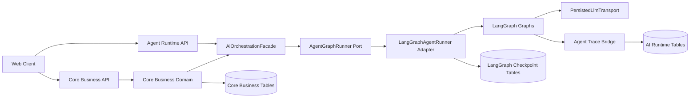

路径级解释：

| 路径 / 层 | 所属域 | 允许依赖 | 禁止依赖 | PR |
|---|---|---|---|---|
| `apps/api/app/api/v1/*` Core endpoints | API composition | Core UseCase、response assembler、auth/session | LangGraph、AgentState、checkpoint payload、provider payload | PR3-PR8 |
| `apps/api/app/api/v1/agent_runs.py` / `ai_tasks.py` | Agent Runtime API | runtime status use case、sanitized timeline assembler | raw prompt、raw completion、provider payload、business write command bypass | PR3-PR4 |
| `apps/api/app/application/*` Core use cases | Core Business | Core repositories、`AiOrchestrationFacade` port、owner/source validation | concrete LangGraph adapter、graph node、checkpoint schema | PR3-PR8 |
| `apps/api/app/application/ai/orchestration_facade.py` | AI application boundary | `AgentGraphRunner` port、AiTask repository、runtime context factory | prompt 拼接、provider 直连、formal object 直接写入 | PR3 |
| `apps/api/app/application/agents/**` | AI Runtime application | graph contracts、state DTO、node/tool/validator interfaces、handoff port | Core internals 反向 import、repository 直接写 formal object | PR4-PR8 |
| `apps/api/app/application/llm/**` | LLM boundary | transport port、trace context、sanitizer contract | provider-specific raw payload 暴露给 API/Core | PR2-PR4 |
| `apps/api/app/infrastructure/agent_runtime/langgraph/**` | shared infrastructure / adapter | LangGraph、checkpointer、runtime repositories | Core Business service、formal write command 直连 | PR4 |
| `apps/api/app/infrastructure/db/models/agent_run.py` 等 runtime models | AI Runtime Tables | DB base、owner、status、trace refs | LangGraph object payload、raw prompt/completion/provider payload | PR2 |
| `apps/api/app/infrastructure/db/models/*` Core models | Core Business Tables | business schema、owner、version、formal objects | LangGraph checkpoint schema、AgentState | PR2-PR8 |

### 5.2 Core Business 与 AI Runtime 依赖图

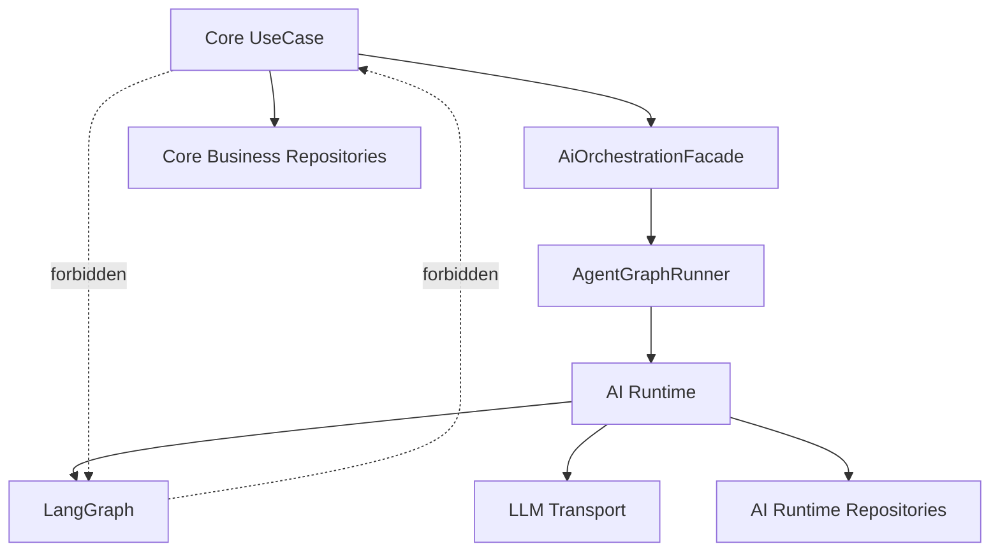

Core Business 不依赖 LangGraph、AgentState、checkpoint schema 或 graph node。Core UseCase 只提交已校验 command/ref，AI Runtime 只通过受控 handoff 写业务结果。

依赖方向固定为：

```text
API Layer
  -> Core UseCase
    -> Core Repository / Query Service
    -> AiOrchestrationFacade
      -> AgentGraphRunner Port
        -> LangGraphAgentRunner Adapter
          -> LangGraph Graph / Node / Tool / Validator
```

禁止反向依赖包括：`Core Business Service -> LangGraph`、`Repository -> Agent Node`、`DB Model -> Agent Runtime`、`Non-AI API Schema -> LLM Payload`、`Frontend basic CRUD -> Agent internals`。

### 5.3 AI Orchestration Facade 边界图

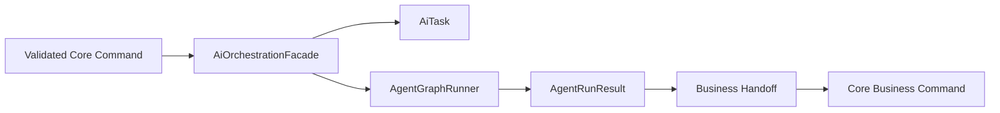

`AiOrchestrationFacade` 负责创建 AI task、选择 graph、传递 trace context、返回 task/status ref。它不拼接 raw prompt，不暴露 AgentState。

Facade 方法必须以业务语义命名，例如 `start_job_match_analysis(...)`、`start_polish_question_generation(...)`、`start_polish_feedback_generation(...)`、`start_report_generation(...)`、`resume_interrupted_run(...)`、`get_agent_run_timeline(...)`。方法输入是 Core 已校验 command / ref，输出是 `AiTaskStatusRef`、`AgentRunStatusRef`、sanitized timeline 或 business handoff status；不得返回 LangGraph checkpoint payload。

### 5.4 Core API vs Agent Runtime API 分离图

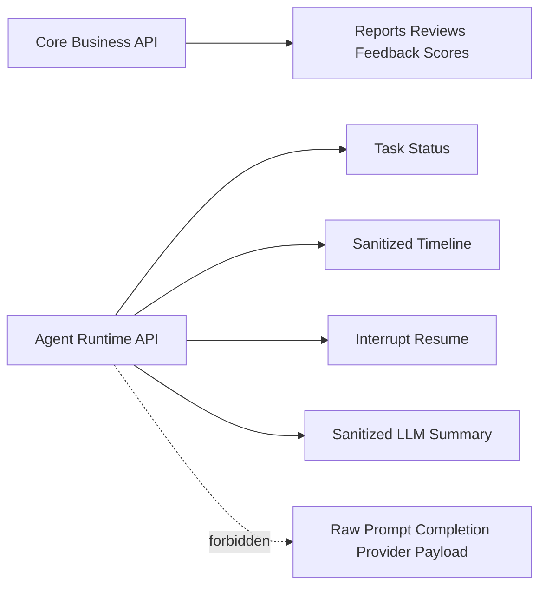

### 5.5 三类表边界图

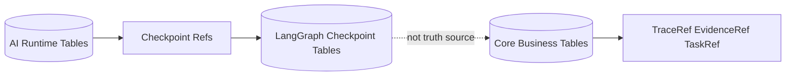

LangGraph checkpoint 只用于 resume/replay/time travel，不是业务事实源。

### 5.6 Agent graph 总览图

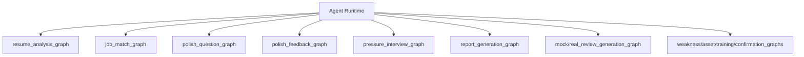

### 5.7 LLM call trace 图

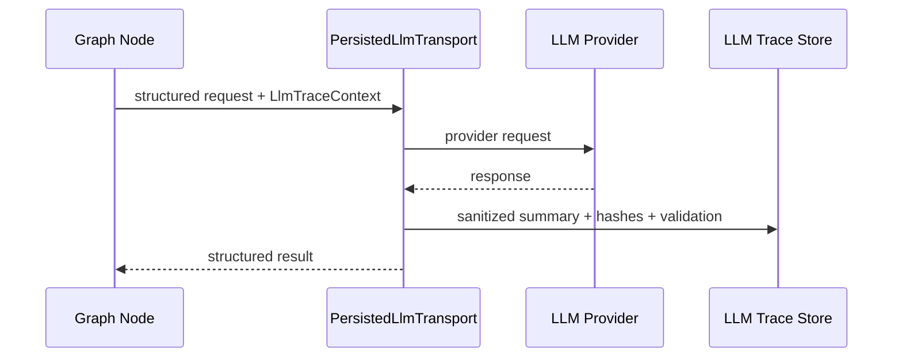

raw prompt、raw completion、provider payload 默认不保存、不进日志、不进 API response。

### 5.7.1 Raw-off payload policy

| 位置 | raw prompt | raw completion | provider request / response payload | 允许保存内容 |
|---|---|---|---|---|
| application log / error log | 禁止 | 禁止 | 禁止 | error category、trace id、status、retryable、sanitized summary |
| `agent_runs` / `agent_node_runs` | 禁止 | 禁止 | 禁止 | graph name、node name、status、duration、input/output schema id、summary hash |
| `llm_calls` / trace tables | 禁止默认保存 | 禁止默认保存 | 禁止默认保存 | provider family、model family、usage、latency、validation status、failure category、redaction refs、hash |
| LangGraph checkpoint | 禁止 | 禁止 | 禁止 | resumable state ids、node state enum、business refs、checkpoint ref |
| API response / timeline | 禁止 | 禁止 | 禁止 | sanitized event、status、business refs、visible error code |
| debug/admin view | 禁止展示 raw payload；只允许看到更细的 sanitized summary、hash、redaction status、retention status | 禁止展示 raw payload | 禁止展示 raw payload | debug-safe metadata |

如后续 PR 因排障提出保存片段，必须另行修改 `SECURITY_PRIVACY.md`、ADR 或 accepted risk，并满足脱敏、限期、禁止前端可见、不可进入 checkpoint 和 release known limitation。PR2-PR8 默认不得新增 raw payload 字段。

### 5.8 Checkpoint / replay / resume 图

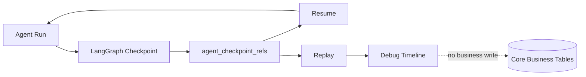

### 5.8.1 Replay / resume write policy

| 场景 | 是否可写 Core Business Tables | 是否可写 AI Runtime Tables | 是否可写 checkpoint refs | 规则 |
|---|---|---|---|---|
| 初次正常 graph run | 仅通过 business handoff / Core command 写入 | 可以 | 可以 | formal object 写入必须经过 Core owner/status/confirmation 校验 |
| resume interrupted run | 只允许写入当前 interrupt 之后的新 handoff，且必须校验 source/session/version 未过期 | 可以追加 node run / event | 可以追加新 checkpoint ref | 不得重放 interrupt 前已确认 formal write |
| replay for debug | 禁止 | 可写 debug-only replay event 或不写 | 可读取 checkpoint ref，不新增 business ref | replay 结果不得进入用户可见业务对象 |
| retry after validation_failed / low_confidence | 只允许在新 task/result 通过 validation 后 handoff | 可以记录 retry event | 可以记录新 checkpoint ref | retry 不得扩大上下文范围或读取 unavailable source 正文 |
| rollback / deploy downgrade | 禁止 late formal write | queued/running task 必须 cancel、timeout 或 mark generation_failed | checkpoint ref 标记不可恢复或版本不兼容 | 不得让旧版本消费新 checkpoint payload |

业务事实源始终是 Core Business Tables 和 active design docs 定义的 formal object / candidate / suggestion / confirmation 链路。Checkpoint 只承接 runtime recovery；checkpoint payload 不能被 API read model、frontend timeline 或报告/复盘/训练链路当作事实来源。

### 5.8.2 Runtime event flow

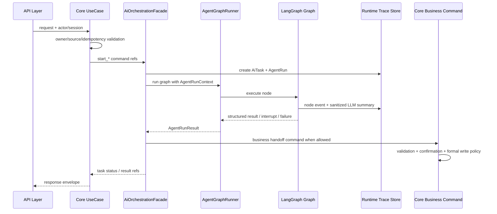

Runtime event 最小序列为：`agent_run_created` -> `node_started` -> `llm_call_started` -> `llm_call_sanitized` -> `node_completed` / `node_failed` -> `validation_completed` -> `handoff_requested` -> `handoff_completed` / `interrupt_created` / `run_failed`。所有事件必须有 owner、actor 或 system actor、trace id、status、event time 和 sanitized summary。

### 5.8.3 Business handoff flow

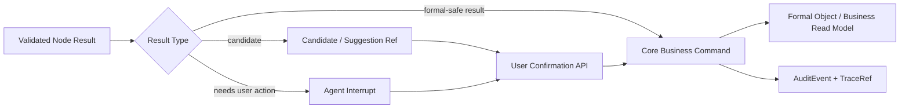

Business handoff 规则：

1. `ScoreResult`、`Question`、`Feedback`、`InterviewReport`、`InterviewReview` 等可由 active docs 允许的结构化结果，必须先完成 schema validation、business validation、owner/source check、trace/evidence binding，再由 Core command 写入。
2. `WeaknessCandidate`、`AssetCandidate`、`AssetVersionSuggestion`、`TrainingRecommendation` candidate、merge/status suggestion 默认只写 candidate / suggestion，不写 formal object。
3. 用户确认、编辑、跳过、拒绝、合并或显式业务动作由 Core API / Core command 处理，并记录 `UserConfirmationRef`、`AuditEvent`、`TraceRef`。
4. LLM node、LangGraph adapter、runtime repository 均不得直接创建、覆盖、删除或关闭 formal business object。

### 5.9 Human interrupt / confirmation 图

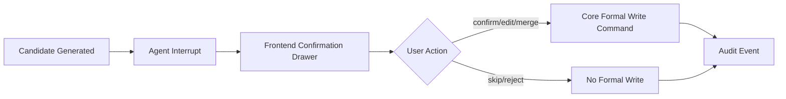

candidate / suggestion 不能静默升级 formal object；formal object 必须来自用户确认或显式 API。

### 5.10 普通用户 vs debug/admin 可见数据矩阵

| 数据 | 普通用户 | debug/admin | 永久禁止 |
|---|---|---|---|
| `AiTask.status`、`AgentRun.status` | 可见，限本人 owner scope | 可见，限授权 scope | 跨 owner 展示 |
| sanitized timeline event | 可见，展示节点名、状态、时间、用户可理解摘要 | 可见更细 event code、failure category、redaction status | raw prompt / completion / provider payload |
| `trace_id` / `request_id` | 可见 | 可见 | 用 trace id 反查正文给未授权角色 |
| `evidence_refs` / `source_availability` | 可见摘要和状态 | 可见 refs、hash、source status | source_deleted/source_disabled/source_unavailable 正文 |
| LLM usage / latency / model family | 默认不可见或只显示生成状态 | 可见统计摘要 | provider key、provider raw payload、完整模型参数 |
| validation / low confidence | 可见用户可行动状态和 next actions | 可见 validation code、rule id、sanitized reason | 未脱敏原文、hidden scoring rules |
| checkpoint ref | 不可见 | 可见 ref、namespace、status、compatibility；不可见 payload | checkpoint payload、AgentState 原文 |
| candidate / suggestion | 可见本人可确认内容和状态 | 可见状态、trace refs、audit refs | 未授权候选、Prompt source、raw completion |
| formal object | 可见本人正式对象 | debug/admin 默认不可见用户正文，除非另有维护授权且已审计 | 用 debug 权限绕过 owner |
| audit event | 用户可见必要确认历史摘要 | 可见安全审计摘要 | copy 正文、Prompt、completion、provider payload、token、secret |

## 6. 与 active docs 的关系

本文是 Option C planning package。长期架构事实必须回写到 `TECH_DESIGN.md`、`APPLICATION_FLOW_SPEC.md`、`PERSISTENCE_MODEL.md`、`DATA_MODEL.md`、`API_SPEC.md`、`PROMPT_SPEC.md`、`SECURITY_PRIVACY.md` 或 ADR。

## 7. 非目标

- 不实现 LangGraph graph。
- 不写表结构、migration 或 ORM。
- 不修改 API schema。
- 不新增前端 UI。
- 不打开 raw payload。
- 不拆出独立 AI service。

## 8. 后续 PR 使用方式

PR2-PR4 先建立 Option C runtime 基础；PR5-PR8 再迁移业务 graph。任何业务链路接入前必须通过 boundary tests 证明 Core Business 不 import LangGraph。

## 9. Definition of Done

- 九类图骨架已覆盖。
- 明确 Core Business 不依赖 LangGraph。
- 明确 Core UseCase 只经 `AiOrchestrationFacade` 触达 AI Runtime。
- 明确 checkpoint 非业务事实源。
- 明确 LLM node 不直接写 formal object。
- 明确 candidate / suggestion 不静默升级 formal object。
