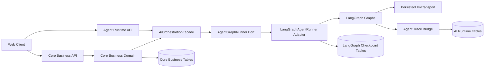
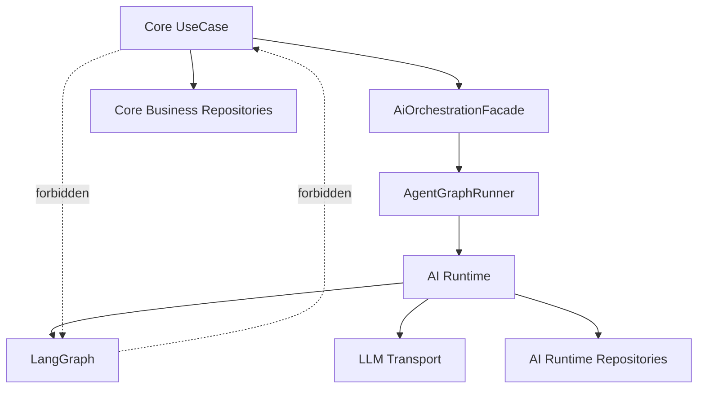
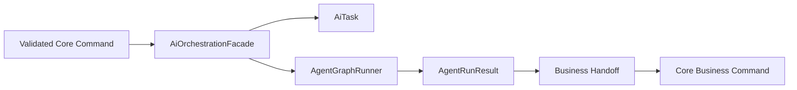
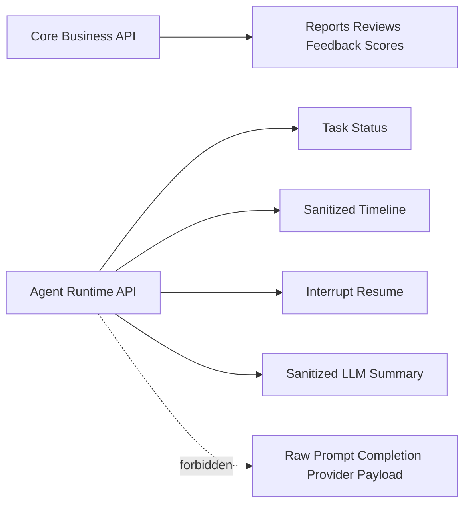
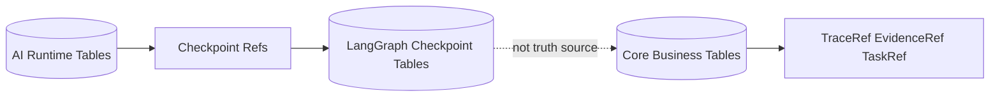
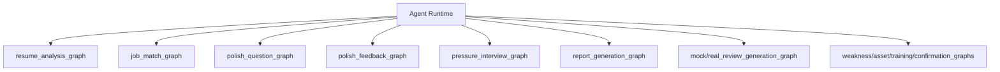
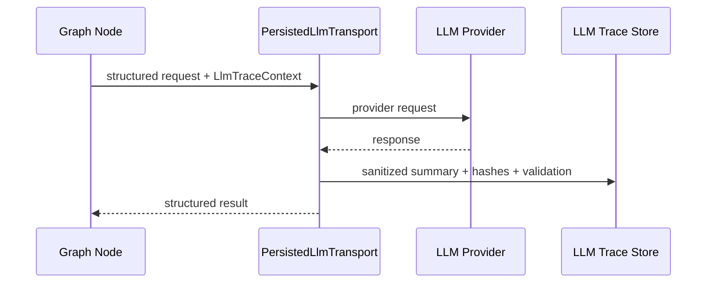
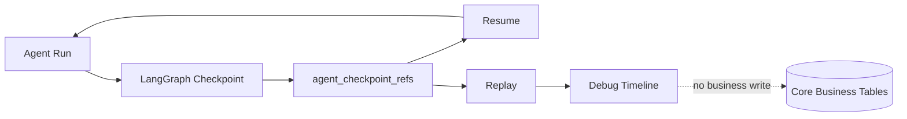
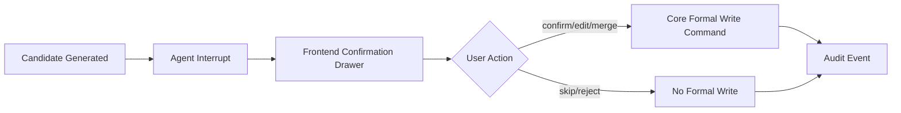

# 推荐架构：LangGraph-first Agentic Workflow Runtime

## 1. 文档目的

本文固化 PR1 推荐架构骨架：在单后端微服务内建立 Core Business 与 AI Runtime 双域，用 `AiOrchestrationFacade` 隔离业务用例与 LangGraph runtime。

## 2. 输入来源

- `docs/tmp/CODEX_LANGGRAPH_MULTIAGENT_README.md`
- `docs/tmp/CODEX_LANGGRAPH_AI_NON_AI_BOUNDARY.md`
- `01_ARCHITECTURE_OPTIONS.md`
- active design docs：`APPLICATION_FLOW_SPEC.md`、`PERSISTENCE_MODEL.md`、`DATA_MODEL.md`、`PROMPT_SPEC.md`、`SCORING_SPEC.md`、`SECURITY_PRIVACY.md`、`API_SPEC.md`

## 3. 当前状态

当前 active docs 已定义 AI task、Prompt contract、trace/evidence、candidate/formal、score、security/privacy 等边界，但尚未有独立的 Agent Runtime API、LangGraph adapter、checkpoint ref、agent timeline 与 interrupt/resume 统一模型。

## 4. 目标输出

目标架构输出：

- 单微服务双域架构。
- Core Business 与 AI Runtime 依赖边界。
- `AiOrchestrationFacade` 作为唯一交界面。
- Core API 与 Agent Runtime API 分离。
- 三类表边界：Core Business Tables、AI Runtime Tables、LangGraph Checkpoint Tables。
- Agent graph 总览、LLM call trace、checkpoint/replay/resume、human interrupt/confirmation 图骨架。

## 5. 必须覆盖范围

### 5.1 单微服务双域架构图

### 5.2 Core Business 与 AI Runtime 依赖图

Core Business 不依赖 LangGraph、AgentState、checkpoint schema 或 graph node。Core UseCase 只提交已校验 command/ref，AI Runtime 只通过受控 handoff 写业务结果。

### 5.3 AI Orchestration Facade 边界图

`AiOrchestrationFacade` 负责创建 AI task、选择 graph、传递 trace context、返回 task/status ref。它不拼接 raw prompt，不暴露 AgentState。

### 5.4 Core API vs Agent Runtime API 分离图

### 5.5 三类表边界图

LangGraph checkpoint 只用于 resume/replay/time travel，不是业务事实源。

### 5.6 Agent graph 总览图

### 5.7 LLM call trace 图

raw prompt、raw completion、provider payload 默认不保存、不进日志、不进 API response。

### 5.8 Checkpoint / replay / resume 图

### 5.9 Human interrupt / confirmation 图

candidate / suggestion 不能静默升级 formal object；formal object 必须来自用户确认或显式 API。

## 6. 与 active docs 的关系

本文是 Option C planning package。长期架构事实必须回写到 `TECH_DESIGN.md`、`APPLICATION_FLOW_SPEC.md`、`PERSISTENCE_MODEL.md`、`DATA_MODEL.md`、`API_SPEC.md`、`PROMPT_SPEC.md`、`SECURITY_PRIVACY.md` 或 ADR。

## 7. 非目标

- 不实现 LangGraph graph。
- 不写表结构、migration 或 ORM。
- 不修改 API schema。
- 不新增前端 UI。
- 不打开 raw payload。
- 不拆出独立 AI service。

## 8. 后续 PR 使用方式

PR2-PR4 先建立 Option C runtime 基础；PR5-PR8 再迁移业务 graph。任何业务链路接入前必须通过 boundary tests 证明 Core Business 不 import LangGraph。

## 9. Definition of Done

- 九类图骨架已覆盖。
- 明确 Core Business 不依赖 LangGraph。
- 明确 Core UseCase 只经 `AiOrchestrationFacade` 触达 AI Runtime。
- 明确 checkpoint 非业务事实源。
- 明确 LLM node 不直接写 formal object。
- 明确 candidate / suggestion 不静默升级 formal object。

