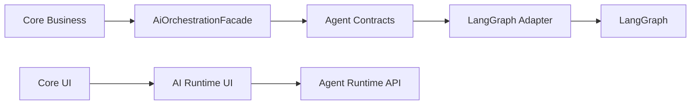

# 目标目录结构与模块边界

## 1. 文档目的

本文规划 LangGraph MultiAgent 重构的目标目录结构、模块职责、允许依赖、禁止依赖、所属域和测试位置。它只规划目录，不创建代码目录或实现文件。

## 2. 输入来源

- `docs/tmp/CODEX_LANGGRAPH_MULTIAGENT_README.md`
- `docs/tmp/CODEX_LANGGRAPH_AI_NON_AI_BOUNDARY.md`
- `02_RECOMMENDED_ARCHITECTURE.md`
- active docs：`APPLICATION_FLOW_SPEC.md`、`PERSISTENCE_MODEL.md`、`DATA_MODEL.md`、`API_SPEC.md`、`SECURITY_PRIVACY.md`
- 主 Agent 对当前 `apps/api/app`、`apps/web/src`、`tests/api` 结构的只读盘点

## 3. 当前状态

当前后端已有 application、infrastructure、db、LLM、polish、job match 等基础结构；当前前端已有 `entities`、`features`、`widgets`、`pages`、`shared` 分层。PR1 不改这些目录，只冻结后续目标结构和边界。

## 4. 目标输出

输出后续 PR2-PR8 可逐步创建的目录和文件规划：

- 后端 `application/ai`、`application/agents`、`infrastructure/agent_runtime`、LLM persisted transport、runtime repositories。
- 前端 `entities/ai-task`、`entities/agent-run`、`features/agent-interrupt-resume`、`features/candidate-confirmation`、`widgets/agent-run-timeline` 等。

## 5. 必须覆盖范围

### 5.1 后端目录骨架

| 目录 / 文件 | 职责 | 允许依赖 | 禁止依赖 | 域 | 测试位置 | 后续 PR 补齐点 |
|---|---|---|---|---|---|---|
| `apps/api/app/application/ai/**` | AI orchestration facade、AI task command/result、runtime status use case | Core command DTO、agent runner port、repositories | LangGraph concrete adapter、provider raw payload | AI Runtime application boundary | `tests/api/test_ai_orchestration_facade.py` | PR3 |
| `apps/api/app/application/agents/**` | Agent runtime contracts、state、registry、trace bridge | DTO、ports、runtime repositories | Core repository direct write、FastAPI routers | AI Runtime | `tests/api/test_agent_contracts.py` | PR3-PR4 |
| `apps/api/app/application/agents/graphs/**` | 业务 graph spec 组合入口 | nodes、validators、tools、contracts | FastAPI routers、Core use case internals | AI Runtime | `tests/api/test_agent_graphs.py` | PR5-PR8 |
| `apps/api/app/application/agents/nodes/**` | Graph node 级业务步骤 | tools、validators、trace context | raw provider client、formal object direct write | AI Runtime | graph-specific tests | PR5-PR8 |
| `apps/api/app/application/agents/tools/**` | Graph-safe tools，读取 source bundle 和调用受控 handoff | query service、facade-safe command | LangGraph checkpoint schema 直接泄漏到 Core | AI Runtime / shared application | graph tests | PR4-PR8 |
| `apps/api/app/application/agents/validators/**` | Schema、business semantics、low confidence validation | prompt contracts、scoring spec DTO | provider raw payload | AI Runtime | validation tests | PR4-PR8 |
| `apps/api/app/application/agents/langgraph_adapters/**` | application 层对 LangGraph adapter 的薄封装或 factory contract | runner port、registry | Core Business internals | AI Runtime boundary | adapter contract tests | PR4 |
| `apps/api/app/infrastructure/agent_runtime/langgraph/**` | 唯一直接 import LangGraph 的 infrastructure adapter | LangGraph、checkpointer、runtime repos | Core Business service | shared infrastructure / AI Runtime adapter | `tests/api/test_langgraph_checkpointer_factory.py` | PR4 |
| `apps/api/app/infrastructure/llm/persisted_transport.py` | LLM transport 持久化 wrapper | lower transport、sanitizer、trace repo | API response objects、business formal write | shared infrastructure | `tests/api/test_persisted_llm_transport.py` | PR2-PR4 |
| `apps/api/app/infrastructure/db/models/agent_run.py` | `agent_runs`、`agent_node_runs`、`agent_interrupts` models | DB base、runtime enums | LangGraph object payload | AI Runtime Tables | `tests/api/test_agent_run_repository.py` | PR2 |
| `apps/api/app/infrastructure/db/models/llm_call.py` | `llm_calls`、`llm_call_payloads` models | DB base、payload policy | raw prompt default-on | AI Runtime Tables | `tests/api/test_llm_call_repository.py` | PR2 |
| `apps/api/app/infrastructure/db/repositories/agent_run.py` | runtime run/node/interrupt repository | SQLAlchemy session、models | Core table write bypass | shared infrastructure | repository tests | PR2-PR4 |
| `apps/api/app/infrastructure/db/repositories/llm_call.py` | LLM call and payload repository | SQLAlchemy session、models | API raw response | shared infrastructure | repository tests | PR2-PR4 |

### 5.2 前端目录骨架

| 目录 | 职责 | 允许依赖 | 禁止依赖 | 域 | 测试位置 | 后续 PR 补齐点 |
|---|---|---|---|---|---|---|
| `apps/web/src/entities/ai-task/**` | AI task types、API client、status helpers | `shared/api`、types | LangGraph checkpoint / raw provider fields | AI Runtime UI entity | `entities/ai-task/**/*.test.ts` | PR7 |
| `apps/web/src/entities/agent-run/**` | agent run summary、timeline event、interrupt types | `shared/api`、runtime DTO | raw prompt/completion/provider payload | AI Runtime UI entity | `entities/agent-run/**/*.test.ts` | PR7 |
| `apps/web/src/features/ai-task-status/**` | polling、retry、cancel、status badge | ai-task entity、shared UI | business object direct mutation | AI Runtime feature | feature tests | PR7 |
| `apps/web/src/features/agent-interrupt-resume/**` | interrupt approve/edit/reject/resume | agent-run entity、shared forms | raw AgentState display | AI Runtime feature | feature tests | PR7 |
| `apps/web/src/features/candidate-confirmation/**` | candidate confirmation drawer and actions | candidate DTO、agent-run interrupt API | silent formal write | AI Runtime / Core handoff UI | feature tests | PR7-PR8 |
| `apps/web/src/widgets/task-status-panel/**` | reusable task status panel | ai-task feature | provider debug payload | AI Runtime widget | widget tests | PR7 |
| `apps/web/src/widgets/agent-run-timeline/**` | sanitized timeline display | agent-run entity | checkpoint payload or raw node state | AI Runtime widget | widget tests | PR7 |

### 5.3 依赖方向规则

禁止依赖：

- `application/core` 或业务 use case 直接 import LangGraph。
- graph node 直接写 formal object。
- frontend timeline 展示 checkpoint payload、AgentState、raw prompt、raw completion、provider payload。

## 6. 与 active docs 的关系

本文仅规划目标目录。实际目录创建、代码迁移和测试补齐必须按 `BACKLOG.md` 后续 AIFI 任务执行；长期目录边界如需成为规范，必须回写 `TECH_DESIGN.md` 或 ADR。

## 7. 非目标

- 不创建代码目录。
- 不移动现有文件。
- 不修改 import。
- 不新增测试文件。
- 不调整 frontend route。
- 不选择具体 package 或依赖版本。

## 8. 后续 PR 使用方式

- PR2 创建 data model / repository 相关目录和 tests。
- PR3 创建 facade、contracts、state、registry。
- PR4 创建 LangGraph adapter、checkpointer、trace bridge。
- PR5-PR8 按 graph 和 UI 切片逐步填充，不允许一次性大范围搬迁。

## 9. Definition of Done

- 指定的后端目录和前端目录均已列出。
- 每个目录都有职责、允许依赖、禁止依赖、所属域、测试位置和后续 PR。
- 明确 Core Business、AI Runtime、shared infrastructure 边界。
- 明确本文不创建目录或代码。

