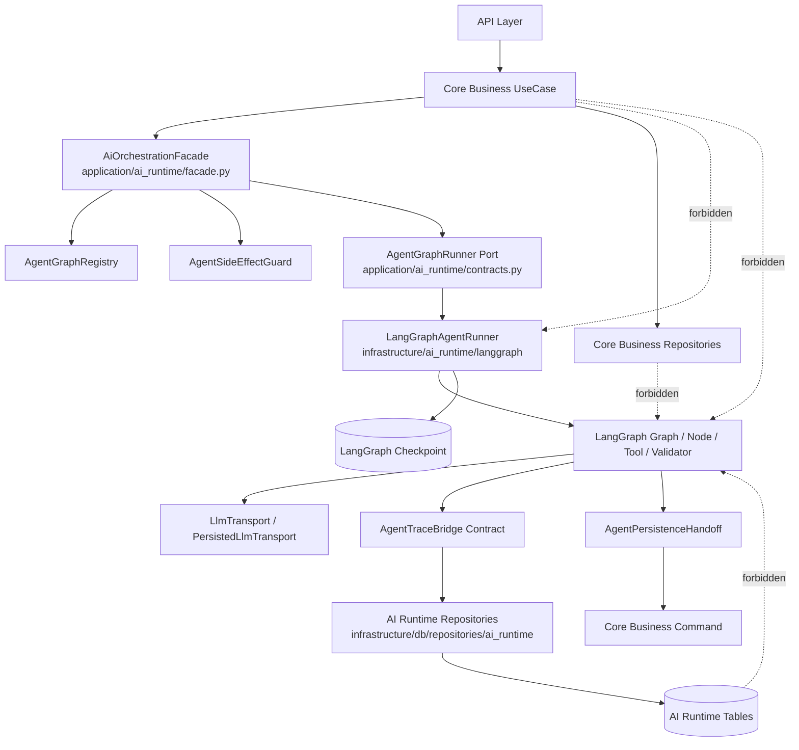

# 目标目录结构与模块边界

## 1. 文档目的

本文冻结 LangGraph MultiAgent 重构的目标目录结构、模块职责、import 规则、architecture boundary test 规则和前后端双域边界。它只规划目录和边界，不创建代码目录、不修改业务代码、不安装依赖。

AIFI-ARCH-008 关闭后的 implementation-ready 判定标准是：后续 PR2-PR8 可以直接按本文创建文件、写测试和做 import scan，不需要再讨论 LangGraph 应放在哪一层，也不能重新引入 `application/ai`、`application/agents`、`infrastructure/agent_runtime` 与 `infrastructure/ai_runtime` 并存的目录形态。

## 2. 输入来源

- `docs/tmp/CODEX_LANGGRAPH_AI_NON_AI_BOUNDARY.md`
- `02_RECOMMENDED_ARCHITECTURE.md`
- `04_BACKEND_AGENT_RUNTIME_PLAN.md`
- active docs：`APPLICATION_FLOW_SPEC.md`、`PERSISTENCE_MODEL.md`、`DATA_MODEL.md`、`API_SPEC.md`、`SECURITY_PRIVACY.md`
- `19_AI_PRODUCT_PROMPT_SKILL_PRESSURE_REMEDIATION_PLAN.md` §5 的 Option 2 目录收敛建议
- 当前代码映射：`apps/api/app/application/llm/types.py`、`ports.py`、`apps/api/app/infrastructure/llm/runtime.py`、`openai_compatible.py`、`fake_transport.py`、`job_match.py`
- 当前 boundary test：`tests/api/test_architecture_boundaries.py`

## 3. 当前状态

当前后端已有 application / infrastructure 分层、`application/llm` port、`infrastructure/llm` fake / OpenAI-compatible transport 和 AST import boundary test。当前代码没有 LangGraph 依赖。AIFI-ARCH-008 最终冻结未来 LangGraph 依赖进入位置：**唯一允许直接 import LangGraph / LangChain graph runtime API 的目录是 `apps/api/app/infrastructure/ai_runtime/langgraph/**`**。

当前前端已有 `entities`、`features`、`widgets`、`pages`、`shared` 分层。PR1.5 只冻结 Core UI 与 AI Runtime UI 的目录边界，不新增前端代码。

## 4. Scope Lock

| 项 | 冻结值 |
|---|---|
| task_id | `AIFI-ARCH-008` |
| allowed write files | `03_TARGET_DIRECTORY_STRUCTURE.md`、`04_BACKEND_AGENT_RUNTIME_PLAN.md`、`17_PR_BREAKDOWN_AND_IMPLEMENTATION_SEQUENCE.md`、`19_AI_PRODUCT_PROMPT_SKILL_PRESSURE_REMEDIATION_PLAN.md`、`docs/04-decisions/ADR-0005-langgraph-agentic-workflow-runtime.md` |
| forbidden writes | `apps/**`、`tests/**`、依赖文件、migration、CI、`BACKLOG.md`、`DOCS_INDEX.md`、其他 docs |
| implementation target | PR2-PR8 |
| non-goal | 不实现 LangGraph graph，不安装依赖，不调用 provider，不 commit / push |

## 5. 后端目标目录骨架

### 5.0 AIFI-ARCH-008 最终目录树

最终目录形态采用 `19_AI_PRODUCT_PROMPT_SKILL_PRESSURE_REMEDIATION_PLAN.md` §5 的 Option 2：聚合 AI Runtime 目录，减少 `application/ai` 与 `application/agents` 的语义分裂。

```text
apps/api/app/
  application/
    ai_runtime/
      __init__.py
      facade.py                 # AiOrchestrationFacade；Core UseCase 唯一入口
      contracts.py              # AgentGraphRunner、AgentGraphState、runtime DTO / errors
      registry.py               # task type -> graph descriptor / contract ids / feature flags
      trace_bridge.py           # runtime trace application contract
      side_effect_guard.py      # raw-off、formal-write、tool-call、checkpoint policy
      handoff.py                # validated AI result -> Core command handoff
      interrupts.py             # interrupt create/read/resume/reject contract
      runtime_flags.py          # runtime default-off / real-provider gate policy
      graphs/                   # PR5-PR8 才可按业务 graph domain 创建
        job_match/
        polish/
        pressure/
        report/
        review/
  infrastructure/
    ai_runtime/
      langgraph/
        __init__.py
        runner.py
        checkpointer_factory.py
        serializer.py
        event_mapper.py
    db/
      models/
        ai_runtime.py           # PR2 runtime ORM models；只保存 refs / summaries / policy metadata
      repositories/
        ai_runtime/
          __init__.py
          agent_runs.py
          llm_calls.py
          checkpoints.py
          interrupts.py
```

PR2 code implementation 当前仍 blocked；解除 blocked 并重新授权前，上述目录树只作为实施边界。解除后，PR2 仅可创建 runtime data / repository / sanitized LLM persistence 相关文件，不得创建 `application/ai_runtime/graphs/**`、不得引入 LangGraph dependency、不得调用真实 provider、不得修改业务 graph。

### 5.0.1 依赖方向图



### 5.0.2 PR1.5 到最终目录的迁移规则

| PR1.5 旧规划 | AIFI-ARCH-008 最终规划 | 结论 |
|---|---|---|
| `apps/api/app/application/ai/orchestration_facade.py` | `apps/api/app/application/ai_runtime/facade.py` | `application/ai/**` 被 `application/ai_runtime/**` 取代 |
| `apps/api/app/application/agents/contracts.py` | `apps/api/app/application/ai_runtime/contracts.py` | `application/agents/**` 被 `application/ai_runtime/**` 取代 |
| `apps/api/app/application/agents/state.py` | `apps/api/app/application/ai_runtime/contracts.py` 或 `graphs/*/state.py` | shared state DTO 归入 `contracts.py`；业务 graph state 仅 PR5-PR8 按 domain 创建 |
| `apps/api/app/application/agents/registry.py` | `apps/api/app/application/ai_runtime/registry.py` | registry 归入 AI Runtime application 根目录 |
| `apps/api/app/application/agents/trace_bridge.py` | `apps/api/app/application/ai_runtime/trace_bridge.py` | trace bridge 仍是 application contract，不含 DB concrete write |
| `apps/api/app/application/agents/side_effect_guard.py` | `apps/api/app/application/ai_runtime/side_effect_guard.py` | policy 归入 AI Runtime application 根目录 |
| `apps/api/app/application/agents/persistence_handoff.py` | `apps/api/app/application/ai_runtime/handoff.py` | handoff 命名缩短并保持 Core command boundary |
| `apps/api/app/application/agents/interrupts.py` | `apps/api/app/application/ai_runtime/interrupts.py` | interrupt contract 归入 AI Runtime application 根目录 |
| `apps/api/app/application/agents/langgraph_adapters/**` | 不创建 | application layer 不允许 `langgraph_adapters`；adapter descriptor 进入 `contracts.py` / `registry.py` 的 project-owned DTO |
| `apps/api/app/infrastructure/agent_runtime/langgraph/**` | `apps/api/app/infrastructure/ai_runtime/langgraph/**` | `infrastructure/agent_runtime/**` 被 `infrastructure/ai_runtime/**` 取代 |

### 5.1 唯一 LangGraph import 目录

| 目录 / 文件 | 职责 | 允许依赖 | 禁止依赖 | 域 | 测试位置 | PR |
|---|---|---|---|---|---|---|
| `apps/api/app/infrastructure/ai_runtime/langgraph/**` | LangGraph concrete adapter、graph compile / invoke / stream、checkpointer factory、serializer factory、interrupt / resume adapter、checkpoint ref extraction | `langgraph`、`langgraph-checkpoint-postgres`、LangChain core abstractions、`application/ai_runtime` contracts、runtime repositories | Core Business service、Core formal write command bypass、API response schema direct write | AI Runtime infrastructure adapter | `tests/api/test_langgraph_checkpointer_factory.py`、`tests/api/test_agent_runtime_fake_graph.py`、`tests/api/test_architecture_boundaries.py` | PR4 |
| `apps/api/app/infrastructure/ai_runtime/langgraph/runner.py` | `LangGraphAgentRunner` concrete implementation | LangGraph compiled graph API、`AgentGraphRunner` port DTO、trace bridge contract、checkpointer factory | Business use case internals、frontend schema、raw provider payload persistence | AI Runtime infrastructure adapter | fake graph start/resume/replay/timeline tests | PR4 |
| `apps/api/app/infrastructure/ai_runtime/langgraph/checkpointer_factory.py` | production / test checkpointer construction and namespace policy | LangGraph checkpoint APIs、Postgres checkpointer when PR4 chooses PG backend、encrypted serializer factory | Core Business tables as checkpoint truth source | AI Runtime infrastructure adapter | checkpointer factory and encrypted serializer tests | PR4 |
| `apps/api/app/infrastructure/ai_runtime/langgraph/serializer.py` | checkpoint serializer selection and `LANGGRAPH_AES_KEY` validation | LangGraph serializer API、secret provider abstraction | logging key material、saving plaintext raw prompt/completion | AI Runtime infrastructure adapter | serializer key validation tests | PR4 |

**Import freeze:** no other backend path may directly import modules whose top-level package starts with `langgraph`, `langchain`, `langchain_core` or `langchain_openai`, except `langchain_core` DTO / message abstractions if PR4 explicitly freezes a narrower allowlist in `18_LANGGRAPH_DEPENDENCY_AND_SPIKE_PLAN.md` and adds AST tests for that allowlist. AIFI-ARCH-008 default is stricter: application layer defines project-owned DTOs and ports, not LangChain DTOs.

### 5.2 Application AI Runtime boundary

| 目录 / 文件 | 职责 | 允许依赖 | 禁止依赖 | 域 | 测试位置 | PR |
|---|---|---|---|---|---|---|
| `apps/api/app/application/ai_runtime/facade.py` | Core UseCase 与 AI Runtime 的唯一交界面；创建 / 复用 `AiTask` 与 `AgentRunContext`；调用 `AgentGraphRunner` port | Core command DTO、owner-checked refs、`application/ai_runtime` contracts、AI task repository port | LangGraph concrete adapter、checkpointer API、provider raw payload、formal object direct write | AI Runtime application boundary | `tests/api/test_ai_orchestration_facade.py` | PR3 |
| `apps/api/app/application/ai_runtime/contracts.py` | `AgentGraphRunner` port、`AgentGraphState` project DTO、runtime DTO、error types、status enums | project-owned DTO、`application/llm` port types by reference | LangGraph / LangChain imports、SQLAlchemy、FastAPI | AI Runtime application contract | `tests/api/test_agent_contracts.py` | PR3 |
| `apps/api/app/application/ai_runtime/registry.py` | `AgentGraphRegistry`：task type -> graph key / contract ids / prompt schema / feature flag / PR owner 映射 | project-owned graph descriptor DTO | LangGraph compiled graph object、infrastructure adapter instance | AI Runtime application service | registry tests | PR3 |
| `apps/api/app/application/ai_runtime/trace_bridge.py` | `AgentTraceBridge` application contract；定义 run / node / LLM / validation / interrupt / checkpoint ref 事件写入接口 | runtime DTO、trace repository port interface | SQLAlchemy concrete session、LangGraph checkpoint object、raw payload | AI Runtime application contract | trace bridge contract tests | PR3 |
| `apps/api/app/application/ai_runtime/side_effect_guard.py` | `AgentSideEffectGuard`：节点副作用白名单、raw-off、formal-write 阻断 | graph descriptor、node intent DTO、policy config | direct DB writes、provider client | AI Runtime application policy | side effect policy tests | PR3 |
| `apps/api/app/application/ai_runtime/handoff.py` | `AgentPersistenceHandoff`：AI result -> Core command handoff contract | validated result DTO、candidate refs、Core command ports | formal object write without confirmation、checkpoint payload | AI Runtime / Core handoff contract | handoff contract tests | PR3-PR4 |
| `apps/api/app/application/ai_runtime/interrupts.py` | `AgentInterruptService` application contract：interrupt create/read/resume validation | owner-checked run refs、resume schema DTO、audit port | LangGraph interrupt object leak、raw AgentState display | AI Runtime application service | interrupt contract tests | PR3-PR4 |
| `apps/api/app/application/ai_runtime/runtime_flags.py` | runtime default-off、per-graph flag、real-provider gate、rollback disable policy | settings DTO、feature flag enum | provider key、LangGraph adapter import、DB session | AI Runtime application policy | runtime flag tests | PR3 |

Application layer **不得创建 `langgraph_adapters/**`**。需要描述 LangGraph adapter 能力时，只能使用 `application/ai_runtime/contracts.py` / `registry.py` 中的 project-owned DTO；concrete adapter、checkpointer、serializer 和 LangGraph API 调用全部留在 `infrastructure/ai_runtime/langgraph/**`。

### 5.3 Core Business 与 DB 边界

| 目录 / 文件 | 职责 | 允许依赖 | 禁止依赖 | 域 | 测试位置 | PR |
|---|---|---|---|---|---|---|
| `apps/api/app/domain/**` | 纯领域对象、业务状态、值对象 | standard library、project domain shared | LangGraph、LangChain、AgentGraphState、infrastructure、FastAPI、SQLAlchemy | Core Business | existing boundary tests | PR2-PR8 |
| `apps/api/app/application/{auth,resumes,jobs,bindings,interviews,reports,reviews,assets,weaknesses,training,scoring,polish}/**` | Core use cases；只处理 owner / command / formal object / candidate confirmation | Core repositories ports、`AiOrchestrationFacade` contract where generation is needed | LangGraph、LangChain、graph node、checkpointer、AgentGraphState、provider client | Core Business application | boundary + use case tests | PR3-PR8 |
| `apps/api/app/infrastructure/db/models/**` | ORM / DB model | SQLAlchemy、domain enums | LangGraph、LangChain、AgentGraphState、checkpoint payload object | shared DB infrastructure | AST boundary tests | PR2 |
| `apps/api/app/infrastructure/db/repositories/ai_runtime/**` | write / read `agent_runs`、`agent_node_runs`、`agent_interrupts`、`agent_checkpoint_refs`、sanitized `llm_calls` | SQLAlchemy、runtime models、project DTO、redaction policy | LangGraph object、Core formal write bypass、raw prompt / raw completion default-on、API response DTO | AI Runtime repository | repository / redaction tests | PR2-PR4 |
| `apps/api/app/infrastructure/db/repositories/*business*.py` | Core Business persistence | SQLAlchemy、business models | LangGraph、AgentGraphState、checkpoint schema | Core Business repository | AST boundary tests | PR2-PR8 |

Core Business、Repository 和 DB Model 禁止依赖 LangGraph 的可执行规则：

```text
Forbidden import prefixes outside apps/api/app/infrastructure/ai_runtime/langgraph/**:
- langgraph
- langchain
- langchain_core
- langchain_openai

Forbidden project imports for Core Business paths:
- app.application.ai_runtime.graphs
- app.infrastructure.ai_runtime.langgraph
- app.infrastructure.agent_runtime
- app.application.agents
- app.application.ai
```

### 5.4 LLM runtime 与 Agent runtime 边界

| 目录 / 文件 | 职责 | 允许依赖 | 禁止依赖 | 域 | 测试位置 | PR |
|---|---|---|---|---|---|---|
| `apps/api/app/application/llm/types.py` | LLM transport request/result DTO，当前已存在 | project enums、safe refs / evidence bundle | LangGraph state、provider response body | application LLM contract | existing / new LLM tests | PR2-PR4 |
| `apps/api/app/application/llm/ports.py` | `LlmTransport` protocol，当前已存在 | project DTO | provider concrete SDK、LangGraph | application LLM contract | existing / new LLM tests | PR2-PR4 |
| `apps/api/app/infrastructure/llm/persisted_transport.py` | wrapper：调用 existing transport，写 sanitized trace / usage / validation | lower `LlmTransport`、sanitizer、trace repository | raw prompt / completion default-on、formal write | shared infrastructure | `tests/api/test_persisted_llm_transport.py` | PR2-PR4 |
| `apps/api/app/infrastructure/llm/openai_compatible.py` | provider adapter，当前已存在；继续禁止日志记录 prompt / completion / provider payload | `httpx`、provider config、project DTO | LangGraph concrete runtime | provider infrastructure | existing LLM tests | PR2-PR8 |
| `apps/api/app/infrastructure/llm/fake_transport.py` | deterministic fake，当前已存在；PR4 fake graph 使用它验证 no-provider path | project DTO、fixtures | provider network call | testable infrastructure | fake transport tests | PR4 |

LangGraph graph node 不直接调用 provider SDK；只能调用 `LlmTransport` 或 `PersistedLlmTransport`，并携带 `LlmTraceContext` / equivalent project DTO。PR4 若需要 LangChain model abstraction，只能在 `infrastructure/ai_runtime/langgraph/**` 内做 adapter，不能替代现有 `application/llm/ports.py`。

## 6. 前端目标目录骨架

### 6.1 AI Runtime UI 目录

| 目录 | 职责 | 允许依赖 | 禁止依赖 | 域 | 测试位置 | PR |
|---|---|---|---|---|---|---|
| `apps/web/src/entities/ai-task/**` | AI task types、API client、status helpers | `shared/api`、sanitized `AiTaskStatusResponse` | LangGraph checkpoint、raw provider fields、raw prompt/completion | AI Runtime UI entity | `entities/ai-task/**/*.test.ts` | PR7 |
| `apps/web/src/entities/agent-run/**` | agent run summary、timeline event、interrupt types | `shared/api`、runtime DTO | AgentState、checkpoint payload、node raw state | AI Runtime UI entity | `entities/agent-run/**/*.test.ts` | PR7 |
| `apps/web/src/features/ai-task-status/**` | polling、retry、cancel、status badge | ai-task entity、shared UI | business object direct mutation | AI Runtime feature | feature tests | PR7 |
| `apps/web/src/features/agent-interrupt-resume/**` | interrupt approve / edit / reject / resume | agent-run entity、shared forms | raw AgentState display | AI Runtime feature | feature tests | PR7 |
| `apps/web/src/features/candidate-confirmation/**` | candidate confirmation drawer and actions | candidate DTO、agent-run interrupt API、Core confirmation API | silent formal write | AI Runtime / Core handoff UI | feature tests | PR7-PR8 |
| `apps/web/src/widgets/task-status-panel/**` | reusable task status panel | ai-task feature | provider debug payload | AI Runtime widget | widget tests | PR7 |
| `apps/web/src/widgets/agent-run-timeline/**` | sanitized timeline display | agent-run entity | checkpoint payload、raw node state、raw prompt、raw completion、provider payload | AI Runtime widget | widget tests | PR7 |

### 6.2 Core UI 与 AI Runtime UI 边界

Core UI 包括 resume / job / binding / polish / report / review / weakness / asset / training 的普通业务页面、表单、列表和详情。Core UI 可读取 `ai_task_id`、`agent_run_id`、status summary、timeline summary 和 candidate refs，但不得导入 Agent 内部状态、checkpoint payload、node raw state 或 provider payload。

AI Runtime UI 只展示：

- task status：queued / running / succeeded / partial / low_confidence / validation_failed / source_unavailable / generation_failed / timed_out / cancelled。
- sanitized timeline event：node key、display status、started/finished time、validation summary、low confidence flags、checkpoint ref id。
- interrupt summary：action schema、candidate refs、required user action、resume status。
- LLM summary：model family、duration、validation status、usage summary；不展示 raw prompt / completion / provider payload。

Candidate confirmation drawer 属于业务确认 UI，不是 LangGraph debug UI。它只能通过 Core confirmation API 或 `AgentInterruptService` resume API 触发正式写入。

## 7. Import 规则和 AST / rg 验证

### 7.1 AST boundary tests

PR3 必须在 `tests/api/test_architecture_boundaries.py` 增加以下测试：

```python
def test_only_langgraph_infrastructure_imports_langgraph() -> None:
    violations = _find_forbidden_imports_outside_allowed_roots(
        APP_ROOT,
        forbidden_prefixes=("langgraph", "langchain", "langchain_core", "langchain_openai"),
        allowed_roots=(APP_ROOT / "infrastructure" / "ai_runtime" / "langgraph",),
    )
    assert violations == []
```

PR3 必须增加 Core Business 禁止依赖 Agent internals 的测试：

```python
def test_core_business_does_not_import_agent_internals() -> None:
    core_roots = [
        APP_ROOT / "domain",
        APP_ROOT / "application" / "auth",
        APP_ROOT / "application" / "resumes",
        APP_ROOT / "application" / "jobs",
        APP_ROOT / "application" / "bindings",
        APP_ROOT / "application" / "interviews",
        APP_ROOT / "application" / "reports",
        APP_ROOT / "application" / "reviews",
        APP_ROOT / "application" / "assets",
        APP_ROOT / "application" / "weaknesses",
        APP_ROOT / "application" / "training",
        APP_ROOT / "application" / "scoring",
    ]
    violations = []
    for root in core_roots:
        violations.extend(
            _find_forbidden_imports(
                root,
                forbidden_prefixes=(
                    "app.application.ai_runtime.graphs",
                    "app.infrastructure.ai_runtime.langgraph",
                    "app.infrastructure.agent_runtime",
                    "app.application.agents",
                    "app.application.ai",
                ),
            )
        )
    assert violations == []
```

PR4 必须补充 repository / DB model scan：

```python
def test_db_models_and_repositories_do_not_import_langgraph() -> None:
    violations = _find_forbidden_imports(
        APP_ROOT / "infrastructure" / "db",
        forbidden_prefixes=("langgraph", "langchain", "langchain_core", "langchain_openai"),
    )
    assert violations == []
```

### 7.2 rg scan 命令

PR3 / PR4 的验证命令必须包含：

```bash
rg -n "from langgraph|import langgraph|from langchain|import langchain|from langchain_core|import langchain_core|from langchain_openai|import langchain_openai" apps/api/app \
  -g "*.py" \
  -g "!apps/api/app/infrastructure/ai_runtime/langgraph/**"

rg -n "AgentGraphState|agent_runtime|application\\.agents|application\\.ai\\b|ai_runtime\\.graphs|infrastructure\\.ai_runtime\\.langgraph" \
  apps/api/app/domain apps/api/app/application apps/api/app/infrastructure/db \
  -g "*.py"
```

预期：第一条命令无输出；第二条命令只允许命中 `apps/api/app/application/ai_runtime/contracts.py`、`registry.py`、`facade.py` 或 PR5-PR8 受权业务 graph contract 文件，不允许命中 Core Business、DB model 或 repository。`application/ai/**`、`application/agents/**`、`infrastructure/agent_runtime/**` 不再是允许命中。

## 8. 与 active docs 的关系

本文仅规划目标目录。实际目录创建、代码迁移和测试补齐必须按 `BACKLOG.md` 后续 AIFI 任务执行；长期目录边界如需成为 canonical 架构规范，必须由主 Agent 汇总回写 `TECH_DESIGN.md`、`APPLICATION_FLOW_SPEC.md`、`PERSISTENCE_MODEL.md`、`SECURITY_PRIVACY.md` 或 ADR。

## 9. 非目标

- 不创建代码目录。
- 不移动现有文件。
- 不修改 import。
- 不新增测试文件。
- 不调整 frontend route。
- 不选择具体 package 版本；依赖与 spike 见 `18_LANGGRAPH_DEPENDENCY_AND_SPIKE_PLAN.md`。若 `18_LANGGRAPH_DEPENDENCY_AND_SPIKE_PLAN.md` 仍出现 PR1.5 的 `infrastructure/agent_runtime/**` 旧路径，PR4-LG-DEP 必须先按本文最终根路径 `infrastructure/ai_runtime/langgraph/**` 同步后再执行依赖引入。

## 10. 后续 PR 使用方式

| PR | 使用本文方式 | 禁止越界 |
|---|---|---|
| PR2 | 当前 blocked；解除后只创建 AI Runtime tables / repositories / sanitized LLM persistence | 不引入 LangGraph dependency；不创建 `application/ai_runtime/graphs/**` |
| PR3 | 创建 `application/ai_runtime` facade、runner port、registry、contracts、policy、handoff、interrupt contract 和 boundary tests | 不 import LangGraph concrete API；不创建 `langgraph_adapters/**` |
| PR4 | 在 `infrastructure/ai_runtime/langgraph/**` 引入 LangGraph adapter、checkpointer、serializer、fake graph runtime | 不迁移业务 graph，不让 Core 直接 import LangGraph |
| PR5-PR8 | 按 `application/ai_runtime/graphs/<business-domain>/**` 逐步填充业务 graph / UI 切片 | 不绕过 facade / handoff / confirmation |

## 11. Definition of Done

- 唯一直接 import LangGraph 的目录已冻结为 `apps/api/app/infrastructure/ai_runtime/langgraph/**`。
- `application/ai/**`、`application/agents/**`、`application/agents/langgraph_adapters/**` 和 `infrastructure/agent_runtime/**` 已明确不创建。
- `checkpointer_factory.py` 和 `LangGraphAgentRunner` 已归属 infrastructure；`AgentTraceBridge` 已归属 application contract；DB write adapter / repository 已归属 `infrastructure/db/repositories`。
- Core Business、Repository、DB Model 禁止依赖 LangGraph 的 import rules 和 AST / rg scan 规则已给出。
- Frontend Core UI 与 AI Runtime UI 边界已冻结。
